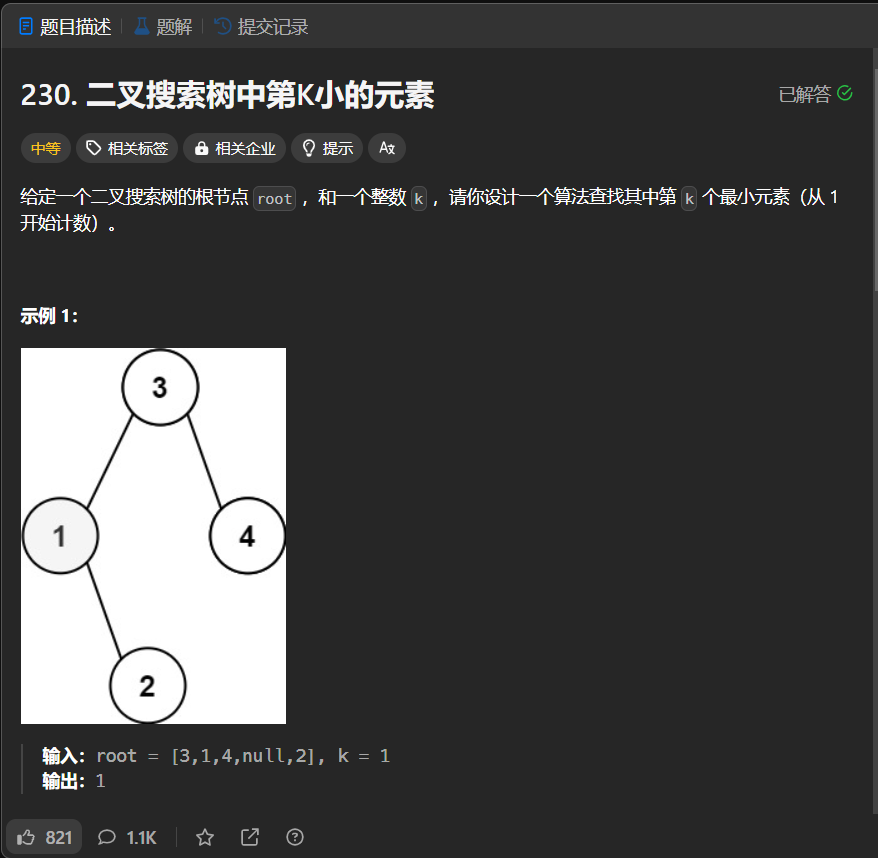

# 230. 二叉搜索树中第K小的元素
## 题目链接  
[230. 二叉搜索树中第K小的元素](https://leetcode.cn/problems/kth-smallest-element-in-a-bst/description/?envType=study-plan-v2&envId=top-interview-150)
## 题目详情


***
## 解答一
答题者：EchoBai

### 题解
中序遍历然后输出即可。

### 代码
``` cpp
/**
 * Definition for a binary tree node.
 * struct TreeNode {
 *     int val;
 *     TreeNode *left;
 *     TreeNode *right;
 *     TreeNode() : val(0), left(nullptr), right(nullptr) {}
 *     TreeNode(int x) : val(x), left(nullptr), right(nullptr) {}
 *     TreeNode(int x, TreeNode *left, TreeNode *right) : val(x), left(left), right(right) {}
 * };
 */
class Solution {
public:
    int kthSmallest(TreeNode* root, int k) {
        vector<int> res;
        inorder(root,res);
        return res[k-1];
    }
    void inorder(TreeNode* root, vector<int> &res){
        if(!root) return;
        inorder(root->left,res);
        res.push_back(root->val);
        inorder(root->right,res);
    }
};
```


