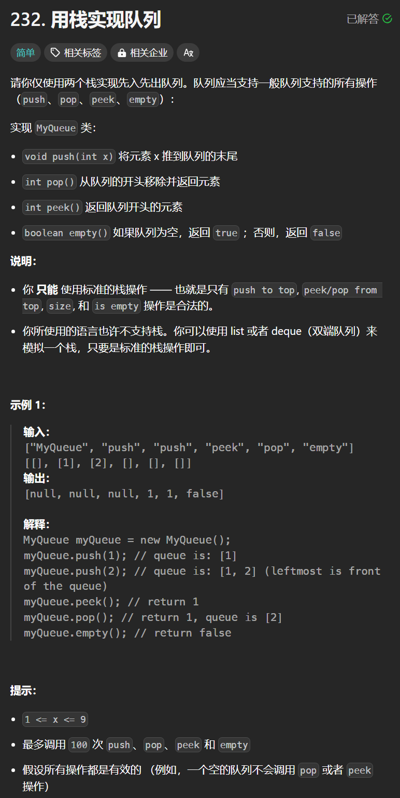

# 232. 用栈实现队列
## 题目链接  
[232. 用栈实现队列](https://leetcode.cn/problems/implement-queue-using-stacks/description/)
## 题目详情


***
## 解答一
答题者：**Yuiko630**

### 题解
>用栈实现队列，注意栈先进后出，队列先进先出，所以可以用两个栈，一个存放进入的顺序，一个存放出来的顺序，倒一下就行。

### 代码
``` Java
import java.util.Stack;

class MyQueue {
    Stack<Integer> stack_in;
    Stack<Integer> stack_out;

    public MyQueue() {
        stack_in = new Stack<>();
        stack_out = new Stack<>();
    }
    
    public void push(int x) {
        stack_in.push(x);
    }
    
    public int pop() {
        if(stack_out.isEmpty()){
            while(!stack_in.isEmpty()){
                stack_out.push(stack_in.pop());
            }
        }
        return stack_out.pop();
    }
    
    public int peek() {
        if(stack_out.isEmpty()){
            while(!stack_in.isEmpty()){
                stack_out.push(stack_in.pop());
            }
        }
        return stack_out.peek();
    }
    
    public boolean empty() {
        if(stack_in.isEmpty() && stack_out.isEmpty()) return true;
        else return false;
    }
}

/**
 * Your MyQueue object will be instantiated and called as such:
 * MyQueue obj = new MyQueue();
 * obj.push(x);
 * int param_2 = obj.pop();
 * int param_3 = obj.peek();
 * boolean param_4 = obj.empty();
 */
```