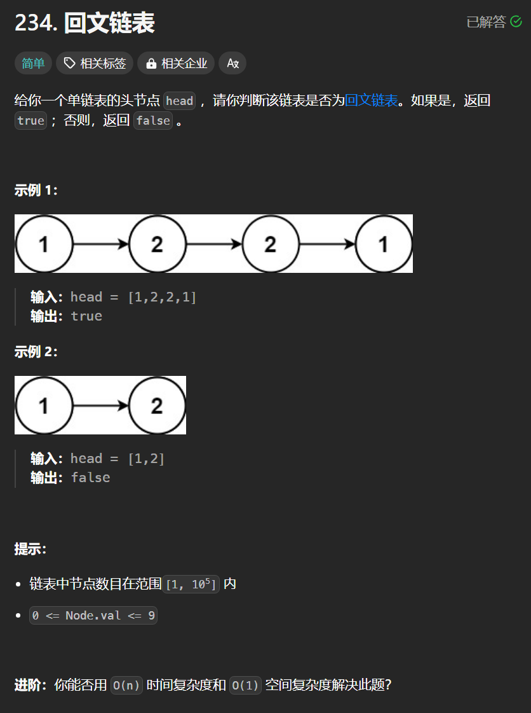

# 234. 回文链表
## 题目链接  
[234. 回文链表](https://leetcode.cn/problems/palindrome-linked-list/description/)
## 题目详情


***
## 解答一
答题者：**Yuiko630**

### 题解
>将链表中的值记录到数组，比对数组头尾

### 代码
``` Java
/**
 * Definition for singly-linked list.
 * public class ListNode {
 *     int val;
 *     ListNode next;
 *     ListNode() {}
 *     ListNode(int val) { this.val = val; }
 *     ListNode(int val, ListNode next) { this.val = val; this.next = next; }
 * }
 */
class Solution {
    public boolean isPalindrome(ListNode head) {
        ListNode cur = head;
        ArrayList<Integer> nums = new ArrayList<>();
        int length = 0;
        while(cur != null){
            nums.add(cur.val);
            length++;
            cur = cur.next;
        }
        for(int i = 0 ; i < length/2 ; i++){
            if(nums.get(i)  != nums.get(length - i - 1)) return false;
        }
        return true;
    }
}
```