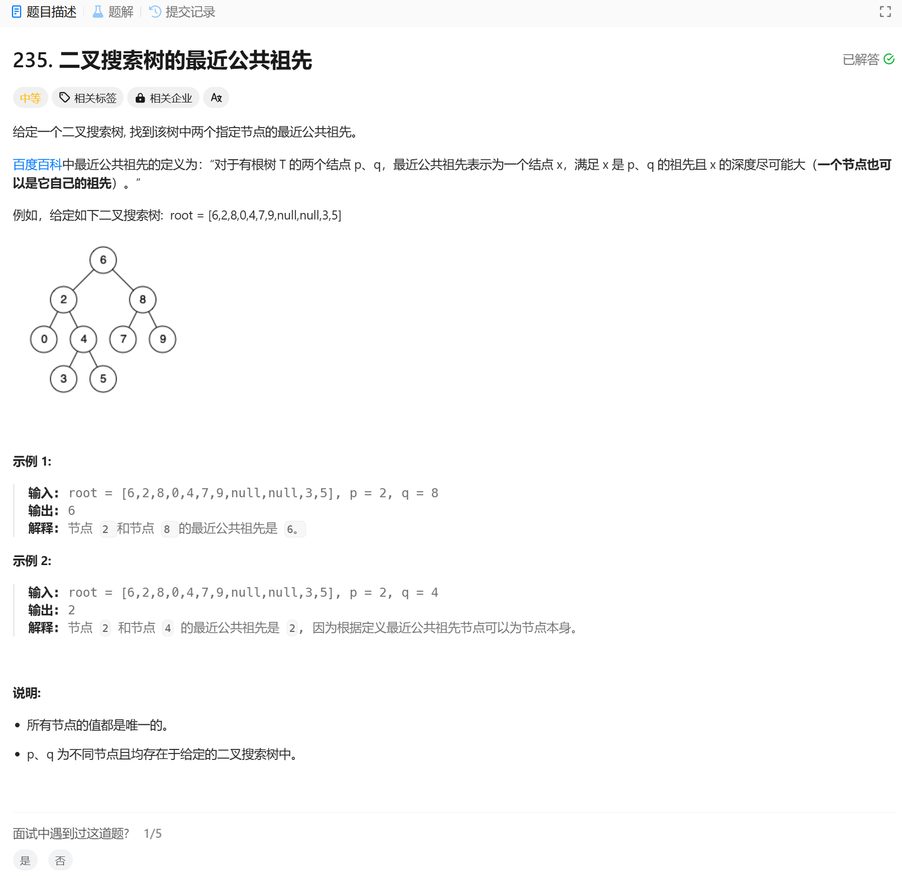

# 235. 二叉搜索树的最近公共祖先
## 题目链接  
[235. 二叉搜索树的最近公共祖先](https://leetcode.cn/problems/lowest-common-ancestor-of-a-binary-search-tree/description/)
## 题目详情


***
## 解答一
答题者：EchoBai

### 题解
这题用235的代码也能直接过，不过因为是二叉搜索树所以可以用大小关系确定需要在那棵树上找，从而减少时间。

### 代码
``` cpp
/**
 * Definition for a binary tree node.
 * struct TreeNode {
 *     int val;
 *     TreeNode *left;
 *     TreeNode *right;
 *     TreeNode(int x) : val(x), left(NULL), right(NULL) {}
 * };
 */

class Solution {
public:
    TreeNode* lowestCommonAncestor(TreeNode* root, TreeNode* p, TreeNode* q) {
        if(root->val > p->val && root->val > q->val){
            // left tree
            return lowestCommonAncestor(root->left, p, q);
        }
        if(root->val < p->val && root->val < q->val){
            //right tree
            return lowestCommonAncestor(root->right, p, q);
        }
        // root->val <= p->val && root->val > q->val
        // root->val > p->val && root->val <= q->val
        // root->val >= p->val && root->val < q->val
        // root->val < p->val && root->val >= q->val
        return root;
    }
};
```
