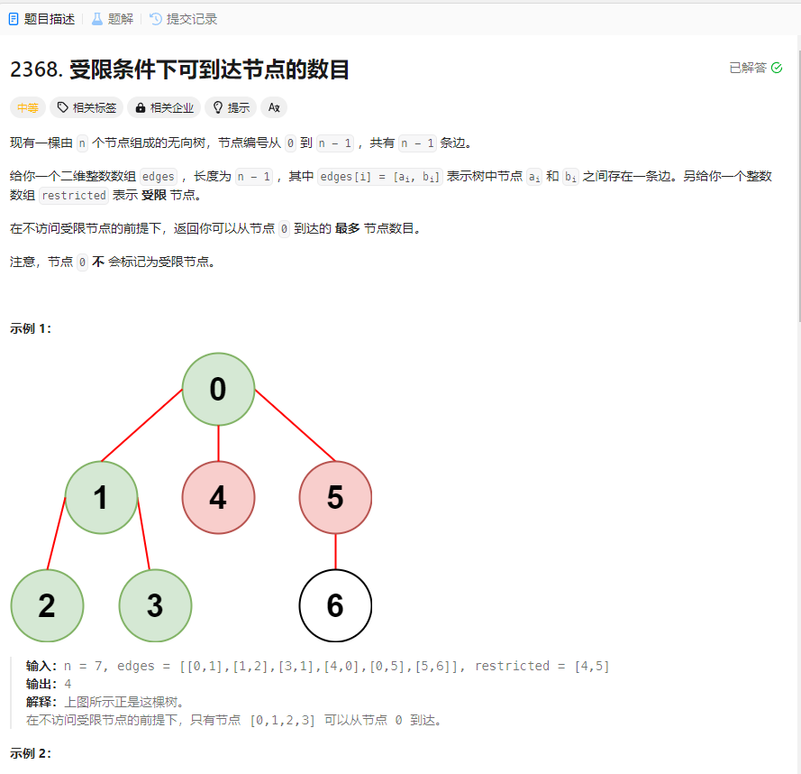

# 2368. 受限条件下可到达节点的数目
## 题目链接  
[2368. 受限条件下可到达节点的数目](https://leetcode.cn/problems/reachable-nodes-with-restrictions/description/?envType=daily-question&envId=2024-03-02)
## 题目详情


***
## 解答一
答题者：EchoBai

### 题解
先根据表建立无向图的邻接表表示，然后使用`dfs`去遍历，发现不是受限节点就继续遍历，同时将该顶点标记为已遍历。

### 代码
``` cpp
class Solution {
public:
    int reachableNodes(int n, vector<vector<int>>& edges, vector<int>& restricted) {
        vector<int> isrestricted(n);
        for(auto e : restricted){
            isrestricted[e] = 1;
        }

        vector<vector<int>> g(n);
        for(auto v : edges){
            g[v[0]].emplace_back(v[1]);
            g[v[1]].emplace_back(v[0]);
        }
        int res = 0;
        dfs(0,isrestricted,g,res);
        return res;

    }
    void dfs(int i, vector<int> &isrestricted, vector<vector<int>> &g, int &ans){
        ++ans;
        isrestricted[i] = 1;
        for(int j : g[i]){
            if(!isrestricted[j])
                dfs(j,isrestricted,g,ans);
        }
    }
};
```


