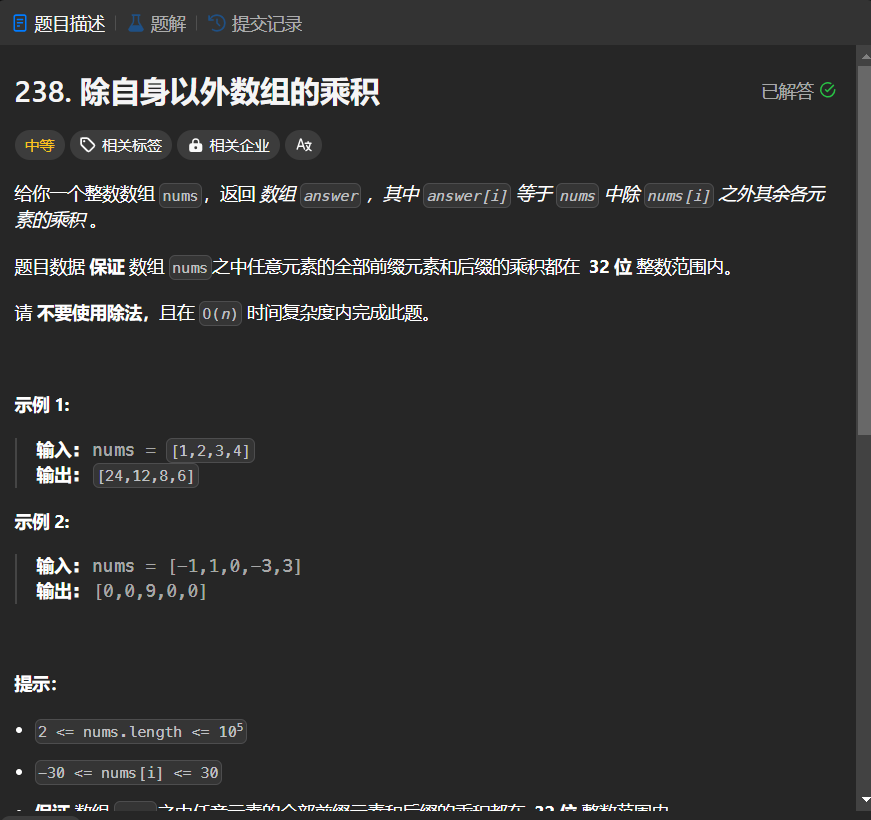

# 238. 除自身以外数组的乘积
## 题目链接  
[238. 除自身以外数组的乘积](https://leetcode.cn/problems/product-of-array-except-self/description/?envType=study-plan-v2&envId=top-interview-150)
## 题目详情


***
## 解答一
答题者：EchoBai

### 题解
将左半部分乘积和右半部分乘积先算出存储，然后依次相乘得到结果。按照一般的方法可以用`O(n^2)`的算法，但是超时。

### 代码
``` cpp
class Solution {
public:
    vector<int> productExceptSelf(vector<int>& nums) {
        int size = nums.size();
        vector<int> res;
        vector<int> L(size, 0), R(size, 0);
        L[0] = 1;
        R[size - 1] = 1;
        for(int i = 1; i < size; ++i){
            L[i] = nums[i - 1] * L[i - 1];
        }
        for(int j = size - 2; j >= 0; --j){
            R[j] = nums[j + 1] * R[j + 1];
        }
        for(int i = 0; i < size; ++i){
            res.push_back(L[i] * R[i]);
        }
        return res;
    }
};
```


