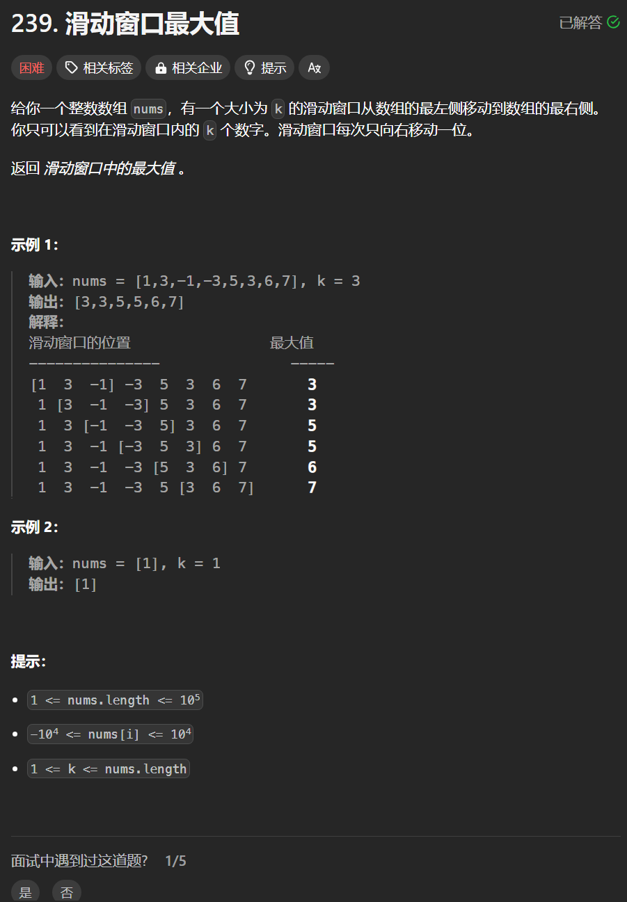

# 239. 滑动窗口最大值
## 题目链接  
[239. 滑动窗口最大值](https://leetcode.cn/problems/sliding-window-maximum/)
## 题目详情


***
## 解答一
答题者：**Yuiko630**

### 题解
>从大到小的单调队列，每次返回最大的队头元素。出队判断是否为最大元素，入队要作为最小元素插入队尾。

### 代码
``` Java
class MyQueue{
    Deque<Integer> deque = new LinkedList<>();
    // 窗口移除元素=队头才移除，即移除最大的
    void poll(int del_num){
        if(!deque.isEmpty() && del_num == deque.peek()){
            deque.poll();
        }
    }
    // push元素按序放入队列，小的出队列舍弃
    void add(int val){
        while(!deque.isEmpty() && val > deque.getLast()){
            deque.removeLast();
        }
        deque.add(val);
    }
    // 单调队列，从大到小，每次返回头就是队列最大值
    int peek(){
        return deque.peek();
    }
}
class Solution {
    public int[] maxSlidingWindow(int[] nums, int k) {
        MyQueue queue = new MyQueue();
        int[] result = new int[nums.length - k + 1];
        for(int i = 0; i < k; i++){
            queue.add(nums[i]);
        }
        int count = 0;
        result[count++] = queue.peek();
        for(int i = k; i < nums.length; i++){
            queue.poll(nums[i-k]);
            queue.add(nums[i]);
            result[count++] = queue.peek();
        }
        return result;
    }
}
```


