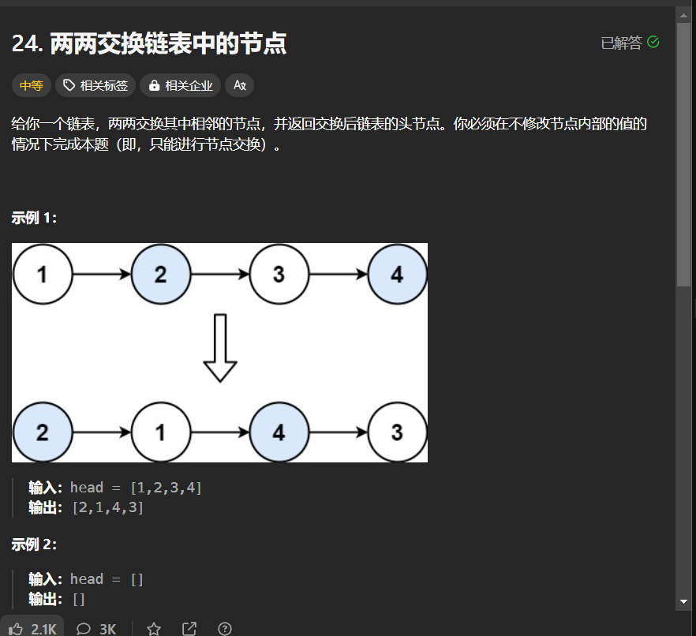

# 24. 两两交换链表中的节点
## 题目链接  
[24. 两两交换链表中的节点](https://leetcode.cn/problems/swap-nodes-in-pairs/description/)
## 题目详情


***
## 解答一
答题者：EchoBai

### 题解
首先可以用栈将节点两两入栈再出栈，这样就逆序了，然后重新创建一个指针将出栈的节点串联起来即可，需要注意的是当节点数目为奇数的时候需要再最后判断一下。另外的解法就是用递归的思想，当节点为空或者为1的时候就结束递归，而我们又可以把两两交换看作一个递归的过程，头节点和其他，这样一直思考下去最小单元要么是2个节点要么就是递归结束条件，然后它在返回交换好后的头节点。

### 代码
``` cpp
/**
 * Definition for singly-linked list.
 * struct ListNode {
 *     int val;
 *     ListNode *next;
 *     ListNode() : val(0), next(nullptr) {}
 *     ListNode(int x) : val(x), next(nullptr) {}
 *     ListNode(int x, ListNode *next) : val(x), next(next) {}
 * };
 */
class Solution {
public:
    ListNode* swapPairs(ListNode* head) {
        if(!head || !head->next)
            return head;
        ListNode *newHead = head->next;
        head->next = swapPairs(newHead->next);
        newHead->next = head;
        return newHead;
    }
};
```

```c++
/**
 * Definition for singly-linked list.
 * struct ListNode {
 *     int val;
 *     ListNode *next;
 *     ListNode() : val(0), next(nullptr) {}
 *     ListNode(int x) : val(x), next(nullptr) {}
 *     ListNode(int x, ListNode *next) : val(x), next(next) {}
 * };
 */
class Solution {
public:
    ListNode* swapPairs(ListNode* head) {
        if(!head || !head->next)
            return head;
        ListNode* cur;
        ListNode *p = new ListNode(-1);
        cur = head;
        head = p;
        stack<ListNode*> stk;
        while(cur && cur->next){
            stk.push(cur);
            stk.push(cur->next);
            cur = cur->next->next;
        
            p->next = stk.top();
            p = p->next;
            stk.pop();
            p->next = stk.top();
            p = p->next;
            stk.pop();
        }
        if(cur){
            p->next = cur;
        }else{
            p->next = nullptr;
        }
        return head->next;
    }
};
```


