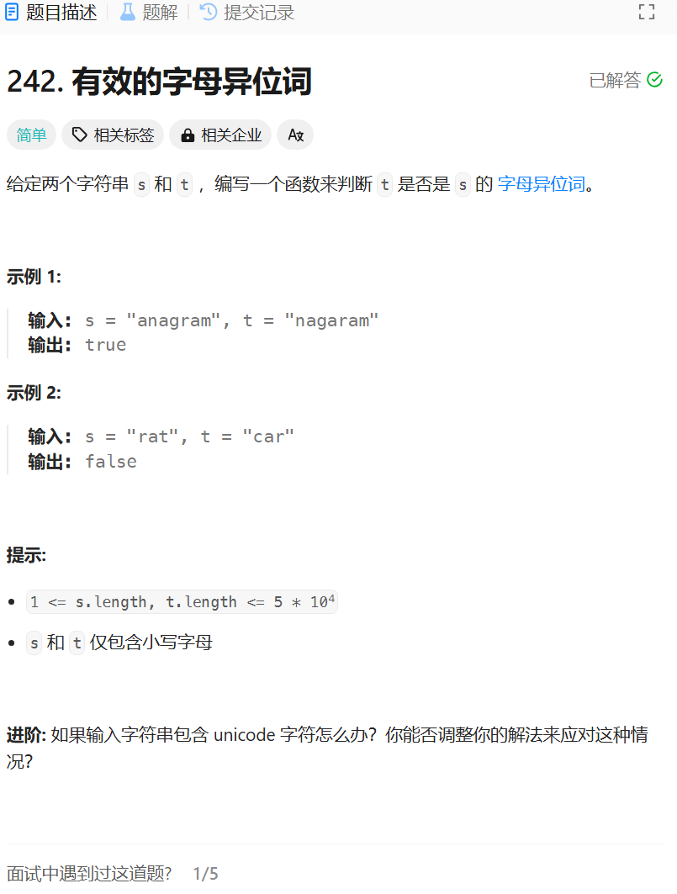

# 242. 有效的字母异位词
## 题目链接  
[242. 有效的字母异位词](https://leetcode.cn/problems/valid-anagram/)
## 题目详情


***
## 解答一
答题者：**Yuiko630**

### 题解
>比较两字符串的长度，不一致直接返回false，因为只会出现小写字母，故可以用2个长度26的数组分别存放每个字母出现的次数，最后比较出现次数是否完全一致。字母存放的下标是-'a'，a对应的ASCII码是97。

### 代码
``` Java
class Solution {
    public boolean isAnagram(String s, String t) {
        if(s.length() != t.length()) return false;
        int[] record_s=new int[26];
        int[] record_t=new int[26];
        for(int i = 0; i < s.length(); i++){
            record_s[s.charAt(i) - 97] ++;
        }
        for(int i = 0; i < s.length(); i++){
            record_t[t.charAt(i) - 97] ++;
        }
        for(int i = 0; i < 26; i ++){
            if(record_s[i] != record_t[i]) return false;
        }
        return true;
    }
}
```


