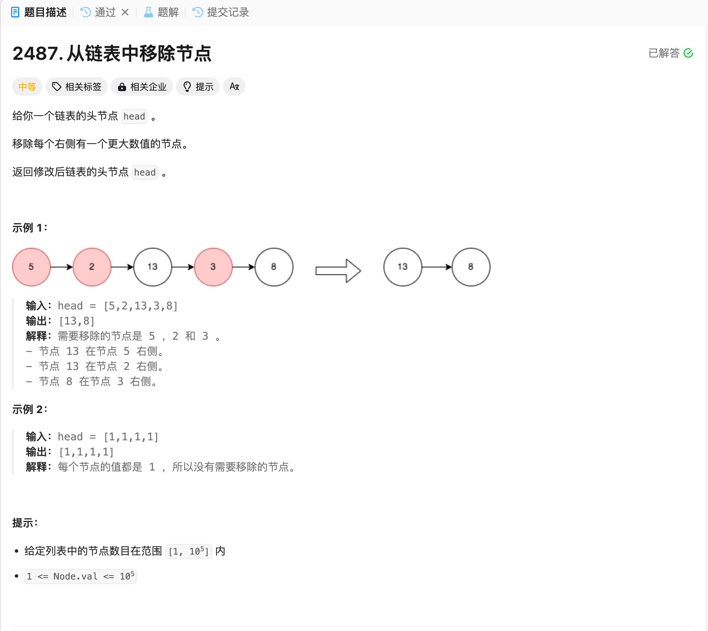

# 2487. 从链表中移除节点
## 题目链接  
[2487. 从链表中移除节点](https://leetcode.cn/problems/remove-nodes-from-linked-list/description/)
## 题目详情


***
## 解答一
答题者：EchoBai

### 题解
用栈来实现，如果小于栈顶元素就入栈，大于就一直出栈。最后重组链表即可

### 代码
``` cpp
/**
 * Definition for singly-linked list.
 * struct ListNode {
 *     int val;
 *     ListNode *next;
 *     ListNode() : val(0), next(nullptr) {}
 *     ListNode(int x) : val(x), next(nullptr) {}
 *     ListNode(int x, ListNode *next) : val(x), next(next) {}
 * };
 */
class Solution {
public:
    ListNode* removeNodes(ListNode* head) {
        if(!head || !head->next) return head; 
        std::stack<ListNode*> st;
        ListNode* p = head;
        head = nullptr;
        st.push(p);
        p = p->next;
        while(p){
            while(!st.empty() && st.top()->val < p->val){
                st.pop();
            }
            st.push(p);
            p = p->next;
        }

        // rebuild link
        while(!st.empty()){
            st.top()->next = head;
            head = st.top();
            st.pop();
        }

        return head;
        
    }
};
```
