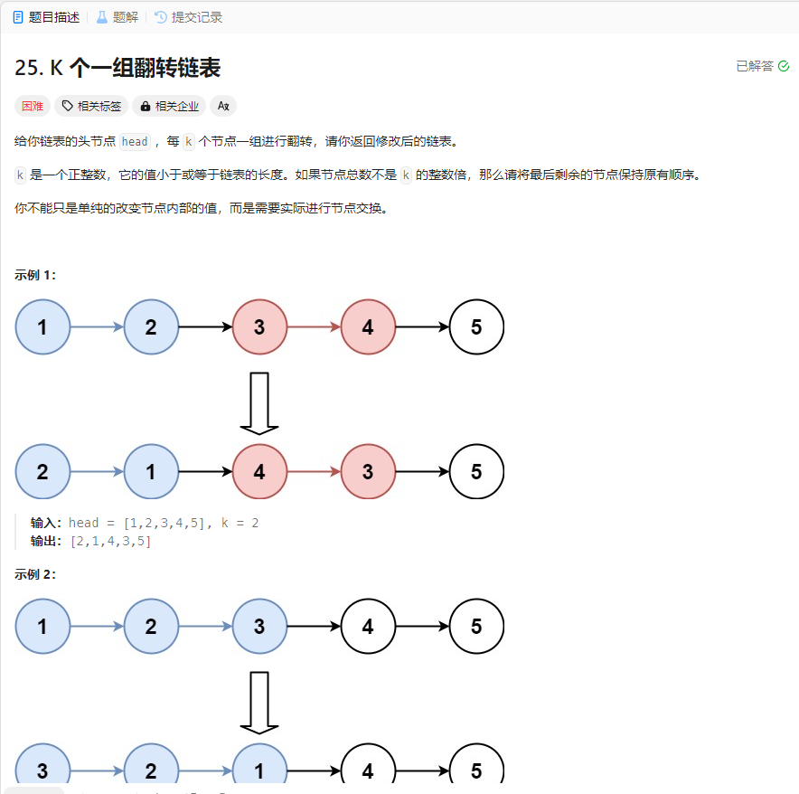

# 25. K 个一组翻转链表
## 题目链接  
[25. K 个一组翻转链表](https://leetcode.cn/problems/reverse-nodes-in-k-group/description/)
## 题目详情


## 解答一
答题者：EchoBai

### 题解
首先统计链表的长度，决定需要做几个翻转操作，然后具体翻转时，我们可以使用`stack`来进行，将节点值`k`个一组入栈，然后出栈重组，需要注意的是出栈的时候要消去节点的`next`信息，同时用`len % k`的值来检查是否有剩余的节点，如果有直接链接到其后就行。

### 代码
``` cpp
/**
 * Definition for singly-linked list.
 * struct ListNode {
 *     int val;
 *     ListNode *next;
 *     ListNode() : val(0), next(nullptr) {}
 *     ListNode(int x) : val(x), next(nullptr) {}
 *     ListNode(int x, ListNode *next) : val(x), next(next) {}
 * };
 */
class Solution {
public:
    ListNode* reverseKGroup(ListNode* head, int k) {
        int len = 0;
        ListNode* p = head;
        ListNode* pt = head;
        if(!head || k == 0 || !head->next) return head;
        ListNode* res = new ListNode(-1);
        head = res;
        while(p){
            ++len;
            p = p->next;
        }
        int cnt = len / k;
        int remainCnt = len % k;
        stack<ListNode*> sk;
        for(int i = 0; i < cnt; ++i){
            int ak = k;
            while(ak > 0){
                sk.push(pt);
                pt = pt->next;
                ak--;
            }
            while(!sk.empty()){
                sk.top()->next = nullptr;
                res->next = sk.top();
                res = res->next;
                sk.pop();
            }  
        }
        if(remainCnt){
            res->next = pt;
        }
        return head->next;
    }
};
```


