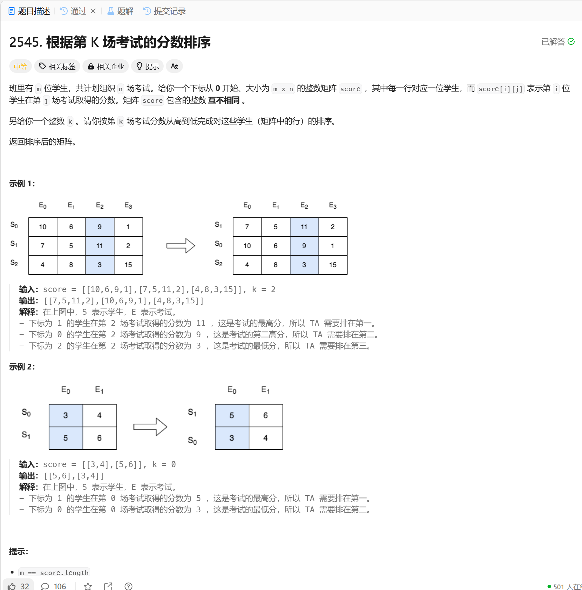

# 2545. 根据第 K 场考试的分数排序
## 题目链接  
[2545. 根据第 K 场考试的分数排序](https://leetcode.cn/problems/sort-the-students-by-their-kth-score/description/?envType=daily-question&envId=2024-12-21)
## 题目详情


***
## 解答一
答题者：EchoBai

### 题解
自定义排序即可。

### 代码
``` cpp
class Solution {
public:
    vector<vector<int>> sortTheStudents(vector<vector<int>>& score, int k) {
        sort(score.begin(),score.end(), [&](const vector<int>& v1, const vector<int>& v2){
            return v1[k] > v2[k];
        });
        return score;
    }
};
```
