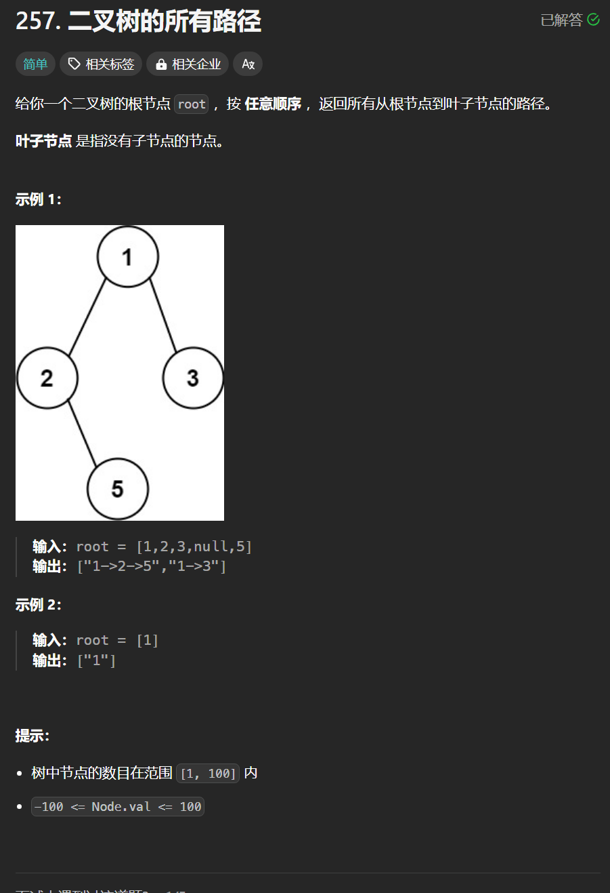

# 257. 二叉树的所有路径
## 题目链接  
[257. 二叉树的所有路径](https://leetcode.cn/problems/binary-tree-paths/)
## 题目详情


***
## 解答一
答题者：**Yuiko630**

### 题解
>递归前序遍历+回溯，递归逻辑：把中节点加入path，遇到叶子节点则添加路径，向左则递归左节点后回溯，向右则递归右节点后回溯。

### 代码
``` Java
/**
 * Definition for a binary tree node.
 * public class TreeNode {
 *     int val;
 *     TreeNode left;
 *     TreeNode right;
 *     TreeNode() {}
 *     TreeNode(int val) { this.val = val; }
 *     TreeNode(int val, TreeNode left, TreeNode right) {
 *         this.val = val;
 *         this.left = left;
 *         this.right = right;
 *     }
 * }
 */
class Solution {
    public List<String> binaryTreePaths(TreeNode root) {
        List<String> results = new ArrayList<String>();
        List<Integer> path = new ArrayList<Integer>();
        traverse(root, path, results);
        return results;
    }
    public void traverse(TreeNode root, List<Integer> path, List<String> results){
        path.add(root.val);
        if(root.left == null && root.right == null){
            String res = new String();
            for(int i = 0 ; i < path.size() -1; i++){
                res += path.get(i).toString();
                res += "->";
            }
            res += path.get(path.size() - 1).toString();
            results.add(res);
        }
        if(root.left != null){
            traverse(root.left, path, results);
            path.remove(path.size() -1);
        }
        if(root.right != null){
            traverse(root.right, path, results);
            path.remove(path.size() -1);
        }
    }
}
```