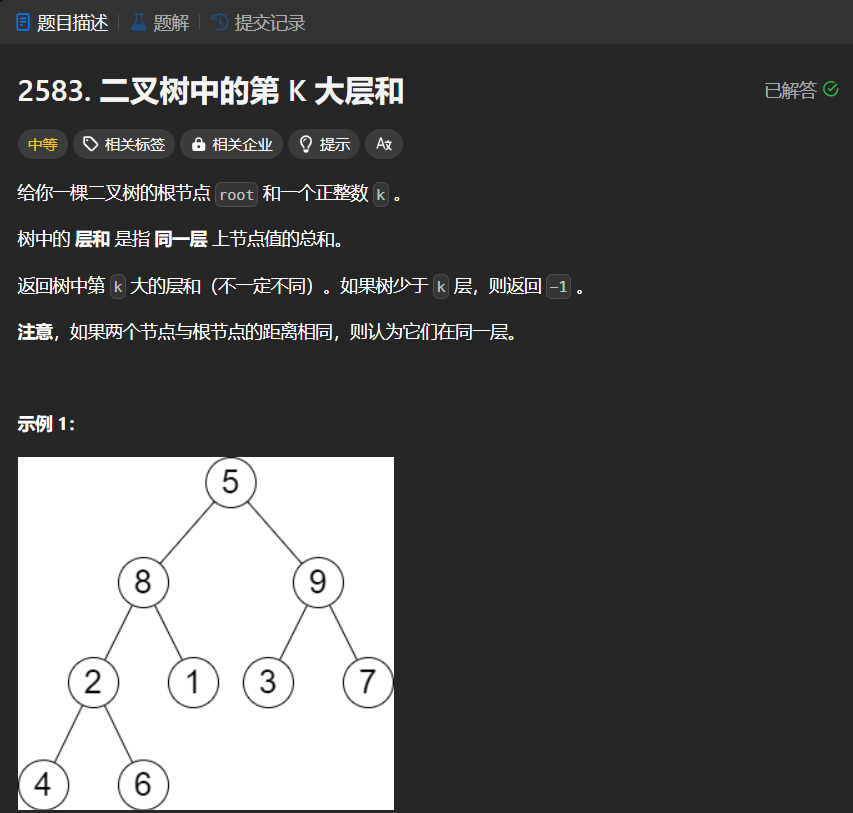

# 2583. 二叉树中的第 K 大层和
## 题目链接  
[2583. 二叉树中的第 K 大层和](https://leetcode.cn/problems/kth-largest-sum-in-a-binary-tree/description/)
## 题目详情


***
## 解答一
答题者：EchoBai

### 题解
用`vector`接收每层层序遍历的元素和，然后排序，返回倒数第k个元素即可。需要注意的是返回的`vector`的`size`即可代表层数，因此还需判断层数和`k`直接的关系。

### 代码
``` cpp
/**
 * Definition for a binary tree node.
 * struct TreeNode {
 *     int val;
 *     TreeNode *left;
 *     TreeNode *right;
 *     TreeNode() : val(0), left(nullptr), right(nullptr) {}
 *     TreeNode(int x) : val(x), left(nullptr), right(nullptr) {}
 *     TreeNode(int x, TreeNode *left, TreeNode *right) : val(x), left(left), right(right) {}
 * };
 */
class Solution {
public:
    long long kthLargestLevelSum(TreeNode* root, int k) {
        vector<long long> res;
        res = levelOrder(root);
        int size = res.size();
        if(size == 0 || size < k) return -1;
        sort(res.begin(),res.end());
        return res[res.size() - k];
        
    }
    vector<long long> levelOrder(TreeNode* root) {
        queue<TreeNode*> q;
        vector<long long> res;
        if(!root)return res;
        q.push(root);
        while(!q.empty()){
            long long sum = 0;
            for(int i = q.size(); i > 0 ; --i){
                TreeNode* e =  q.front();
                q.pop();
                sum += e->val;
                if(e->left) q.push(e->left);
                if(e->right) q.push(e->right);
            }
            res.push_back(sum);
        }
        return res;
        
    }
};
```


