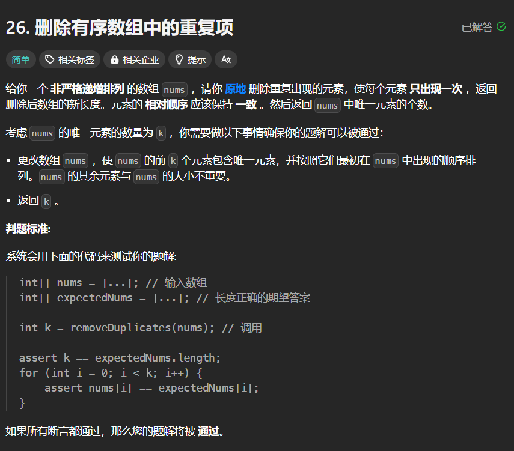
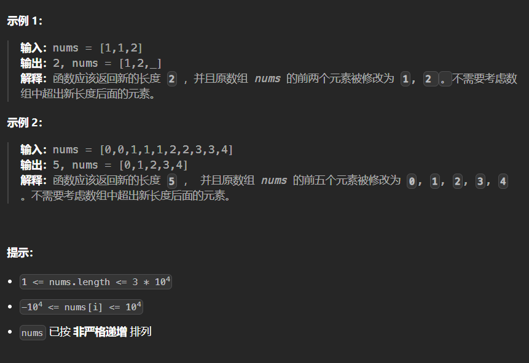

# 26. 删除有序数组中的重复项
## 题目链接  
[26. 删除有序数组中的重复项](https://leetcode.cn/problems/remove-duplicates-from-sorted-array/description/)
## 题目详情


***
## 解答一
答题者：**Echobai**

### 题解
该题因为需要利用原数组空间，因此我们不能通过遍历一遍然后取出每个不同数字来得到新数组，因此可以考虑使用双指针的解法，通过使用`left,right`两个指针，因为每个元素为1，因此初始`left,right`距离为1，大致思路为`right`指针往右走，通过比较左右两个数是否相同，如果相同则右指针继续前进，直到找到一个与左指针值不同的值，此时将左指针的下一个指向的值赋为右指针指向的值，然后左指针前进一个，指向下一个唯一的值，右指针前进一个继续检索，重复上述过程，最终得到的就是前`left + 1`个不同的值。

### 代码

```c++
class Solution {
public:
    int removeDuplicates(vector<int>& nums) {
        if(nums.size() == 0)
            return 0;
        int left = 0;
        int right = 1;
        while(right < nums.size()){
            if(nums[left] == nums[right]){
                right++;
            }else{
                nums[left+1] = nums[right];
                left++;
                right++;
            }
        }
        return left+1;
    }
};
```
## 解答二
答题者：**Yuiko630**

### 题解
因为数组是非严格递增排列，所以可以用双指针left和right，left指向当前保存的值，right指向遍历到的值，只要right指向和left不一致，就可以让left+1的位置存下right值。因为left始终表示当前下标，所以最终返回的长度是left+1。

### 代码

```Java
class Solution {
    public int removeDuplicates(int[] nums) {
        if(nums.length == 0){
            return 0;
        }
        int left = 0;
        for(int right = 0; right < nums.length; right ++){
            if(nums[left] != nums[right]){
                nums[++left] = nums[right];
            }
        }
        return left+1;
    }
}
```