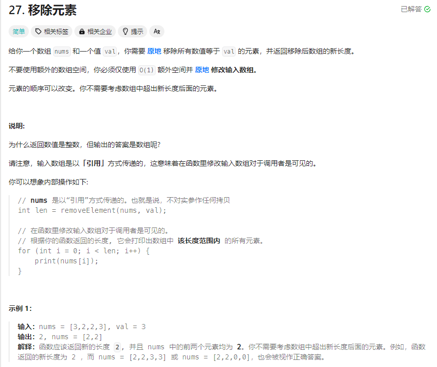

# 27. 移除元素
## 题目链接  
[链接](https://leetcode.cn/problems/remove-element/?envType=study-plan-v2&envId=top-interview-150)
## 题目详情


***
## 解答一
答题者：** Curtis **
### 代码
``` cpp
class Solution {
public:
    int removeElement(vector<int>& nums, int val) {
        for(int i = 0;i<nums.size();i++){
            
            if(nums[i]==val){
                nums.erase(nums.begin()+i);
                i--;
            }
        }
        return nums.size();
    }
};
```

### 题解

>找到删除即可