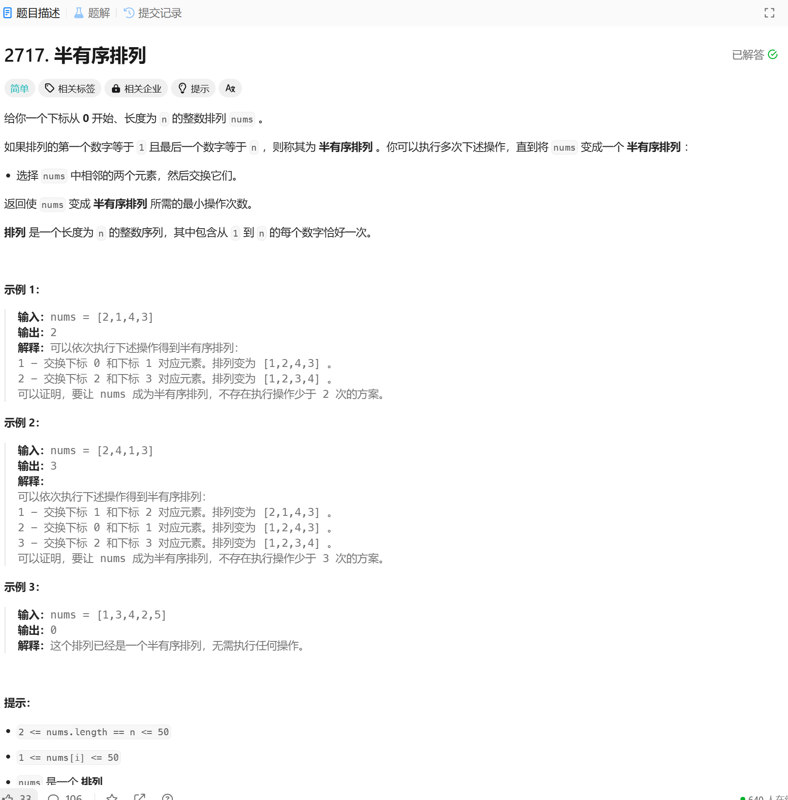

# 2717. 半有序排列
## 题目链接  
[2717. 半有序排列](https://leetcode.cn/problems/semi-ordered-permutation/description/?envType=daily-question&envId=2024-12-11)
## 题目详情


***
## 解答一
答题者：**EchoBai**

### 题解
>找出最大最小元素的位置，然后如果小的在左边，大的在右边，那么就小的往左依次移动大的往右依次移动，如果大的在左，小的在右，那么必然中间会有一次二者相互交换，这一次交换会使得两者的位置都靠近目标一步，相当于移动了2次，因此在第一种的基础上还要减去1.

### 代码

```c++
class Solution {
public:
    int semiOrderedPermutation(vector<int>& nums) {
        int n = nums.size();
        auto [loc1, locn] = ranges::minmax_element(nums);
        if(locn < loc1){
            return loc1 + n - locn - 2;
        }
        return loc1 + n - locn - 1;

    }
};
```