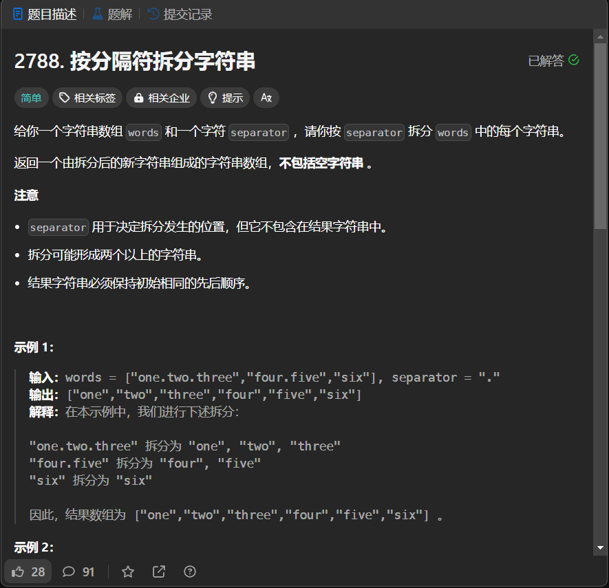

# 2788. 按分隔符拆分字符串
## 题目链接  
[2788. 按分隔符拆分字符串](https://leetcode.cn/problems/split-strings-by-separator/description/?envType=daily-question&envId=2024-01-20)
## 题目详情


***
## 解答一
答题者：EchoBai

### 题解
直接子函数遍历拆分即可。

### 代码
``` cpp
class Solution {
public:
    vector<string> splitWordsBySeparator(vector<string>& words, char separator) {
        vector<string> res;
        for(auto s: words){
            vector<string> tmp = splitSingleWords(s,separator);
            for(auto t : tmp){
                if(t != "" )
                    res.push_back(t);
            }
        }
        return res;
    }
    vector<string> splitSingleWords(string &s, char separator){
        vector<string> res;
        int i = 0;
        while(i < s.size()){
            int index = i;
            int len = 0;
            while(s[i] != separator && i < s.size()){
                ++i;
                ++len;
            }
            res.push_back(s.substr(index, len));
            ++i;
        }
        return res;
    }
};
```


