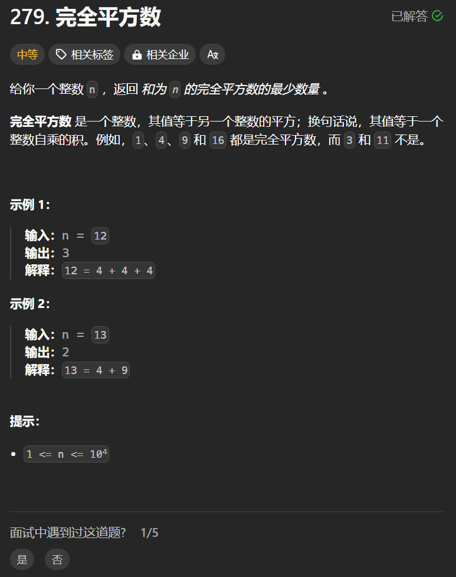

# 279. 完全平方数
## 题目链接  
[279. 完全平方数](https://leetcode.cn/problems/perfect-squares/description/)
## 题目详情


***
## 解答一
答题者：**Yuiko630**

### 题解
>dp，五部曲
>1. 定义:dp[j]表示和为j最少需要dp[j]个完全平方数
>2. 转移方程:dp[j] = min(dp[j-i*i]+1, dp[j])
>3. 初始化:dp[0]=0，凑成0不需要硬币，dp[非0]=Integer.MAX_VALUE，因为是要找最少个数，所以全部初始化为最大的
>4. 遍历:组合问题外层遍历物品从1-根号n，内层遍历容量从i*i到n
>5. 推导

### 代码
``` Java
class Solution {
    public int numSquares(int n) {
        int[] dp = new int[n + 1];
        for (int j = 1; j < dp.length; j++) {
            dp[j] = Integer.MAX_VALUE;
        }
        dp[0] = 0;
        for(int i = 1; i * i <= n; i++){
            for(int j = i*i; j <= n; j++){
                dp[j] = Math.min(dp[j], dp[j-i*i] + 1);
            }
        }
        return dp[n];
    }
}
```