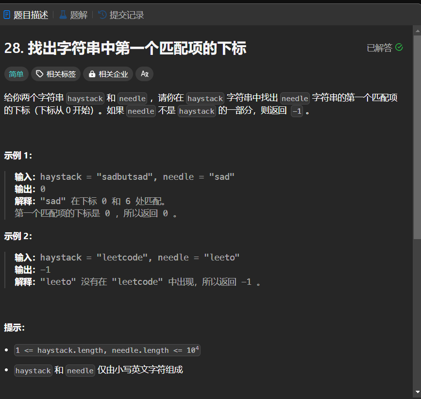

# 28. 找出字符串中第一个匹配项的下标
## 题目链接  
[28. 找出字符串中第一个匹配项的下标](https://leetcode.cn/problems/find-the-index-of-the-first-occurrence-in-a-string/description/)
## 题目详情


***
## 解答一
答题者：EchoBai

### 题解
直接遍历即可。

### 代码
``` cpp
class Solution {
public:
    int strStr(string haystack, string needle) {
        for(int i = 0; i < haystack.size(); ++i){
            int index = 0;
            int j = i;
            while(index < needle.size() && haystack[j] == needle[index] ){
                ++index;
                ++j;   
            }
            if(index == needle.size())
                return i;
        }
        return -1;
    }
};
```
