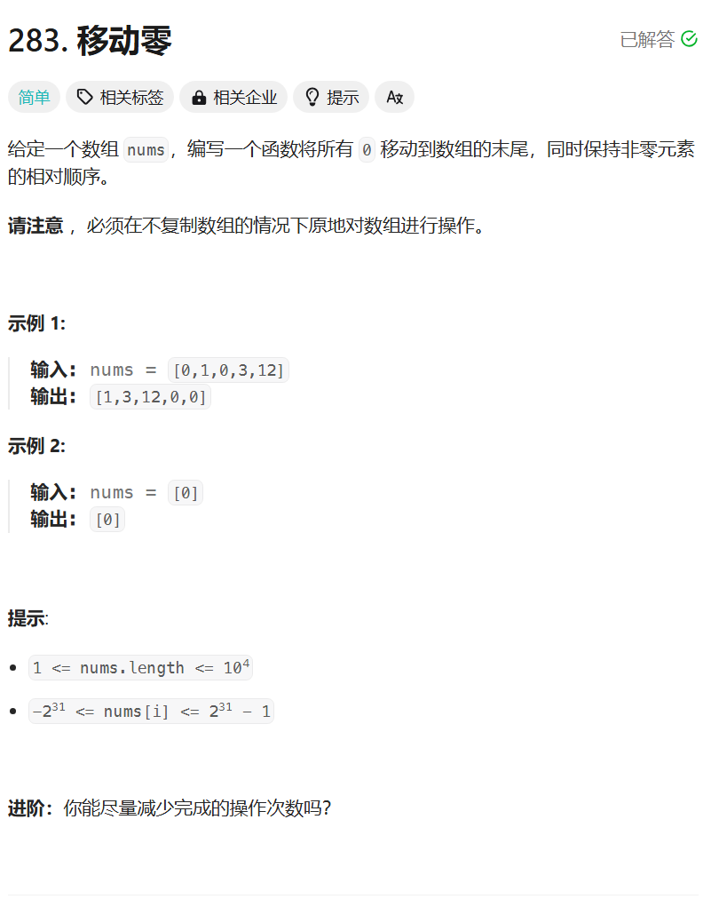

# 283. 移动零
## 题目链接  
[283. 移动零](https://leetcode.cn/problems/move-zeroes/description/)
## 题目详情


***
## 解答一
答题者：**Yuiko630**

## 题解
>双指针，快指针去找下一个不为0的元素，与慢指针交换。

### 代码
``` Java
class Solution {
    public void moveZeroes(int[] nums) {
        int slow = 0;
        int fast = 0;
        for(fast = 0; fast < nums.length; fast++){
            if(nums[fast] != 0){
                int temp = nums[fast];
                nums[fast] = nums[slow];
                nums[slow++] = temp;
            }
        }
    }
}
```