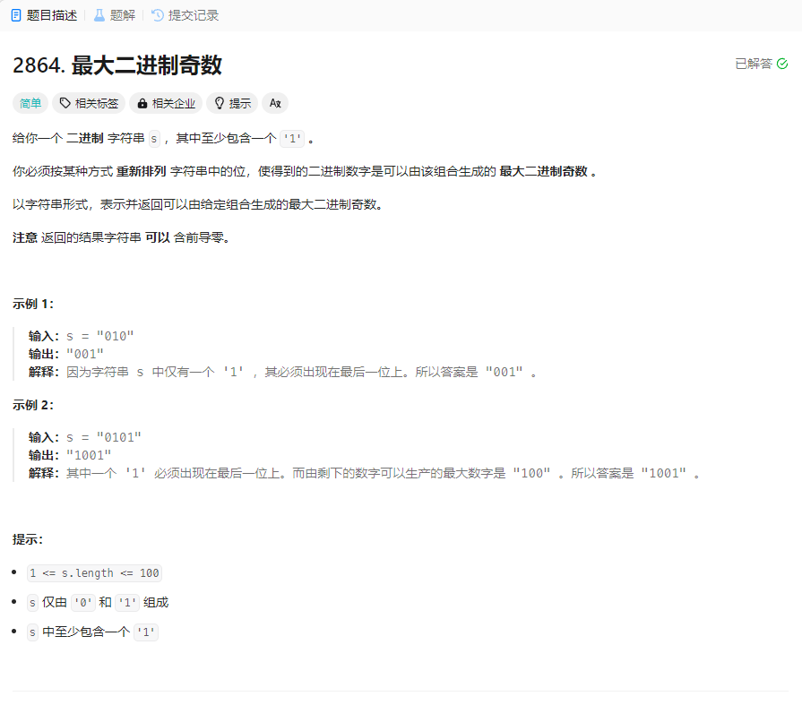

# 2864. 最大二进制奇数
## 题目链接  
[2864. 最大二进制奇数](https://leetcode.cn/problems/maximum-odd-binary-number/description/?envType=daily-question&envId=2024-03-13)
## 题目详情


***
## 解答一
答题者：EchoBai

### 题解
统计字符`1,0`的个数，将`1`放在前面，后跟`0`，最后跟上`1`即可。

### 代码
``` cpp
class Solution {
public:
    string maximumOddBinaryNumber(string s) {
        int oneCnt = 0;
        int zeroCnt = 0;
        string res;
        for(int i = 0; i < s.size(); ++i){
            if(s[i] == '0')
                ++zeroCnt;
            else
                ++oneCnt;
        }
        if(oneCnt == 1){
            for(int i = 0; i < zeroCnt; ++i){
                res += '0';
            }
            res += '1';
        }else if(oneCnt > 1) {
            for(int i = 0; i < oneCnt - 1; ++i){
                res += '1';
            }
            for(int i = 0; i < zeroCnt; ++i){
                res += '0';
            }
            res += '1';
        }else {
            for(int i = 0; i < zeroCnt; ++i){
                res += '0';
            }
        }
        return res;
        
    }
};
```


