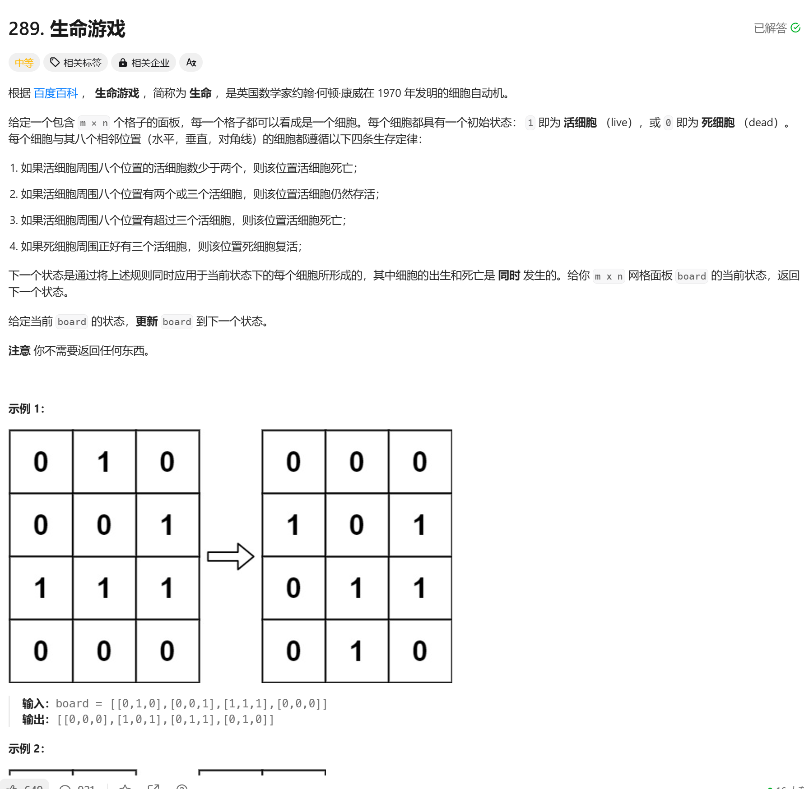

# 289. 生命游戏
## 题目链接  
[289. 生命游戏](https://leetcode.cn/problems/game-of-life/description/)
## 题目详情


***
## 解答一
答题者：EchoBai

### 题解
直接按题意统计每个细胞周围细胞的情况，然后挨个改变状态即可，需要注意的时由于细胞的状态是同时改变的因此要先拷贝一份数组，不然改变状态会导致统计数量也发生改变。

### 代码
``` cpp
class Solution {
    static constexpr int DIRS[8][2] = {{0, -1}, {0, 1}, {-1, 0}, {1, 0}, {-1, -1}, {1, 1}, {1, -1}, {-1, 1}}; // eight direction
public:
    void gameOfLife(vector<vector<int>>& board) {
        vector<vector<int>> tboard = board;
        for(int i = 0; i < tboard.size(); ++i){
            for(int j = 0; j < tboard[i].size(); ++j){
                int liveCellNums = 0;
                getLiveCellsNum(tboard, i, j, liveCellNums);
                if(tboard[i][j] == 1){
                    if(liveCellNums < 2 || liveCellNums > 3){
                        board[i][j] = 0;
                    }
                }else{
                    if(liveCellNums == 3){
                        board[i][j] = 1;
                    }
                }
            }
        }
    }

    void getLiveCellsNum(vector<vector<int>> board, int x0, int y0, int& liveCellNums){
        int m = board.size();
        int n = board[x0].size();
        for(const auto& [dx, dy] : DIRS){
            int x = x0 + dx;
            int y = y0 + dy;
            if(0 <= x && x < m && 0 <= y && y < n){
                if(board[x][y] == 1){
                    liveCellNums++;
                }
            }
        }
    }
};
```
