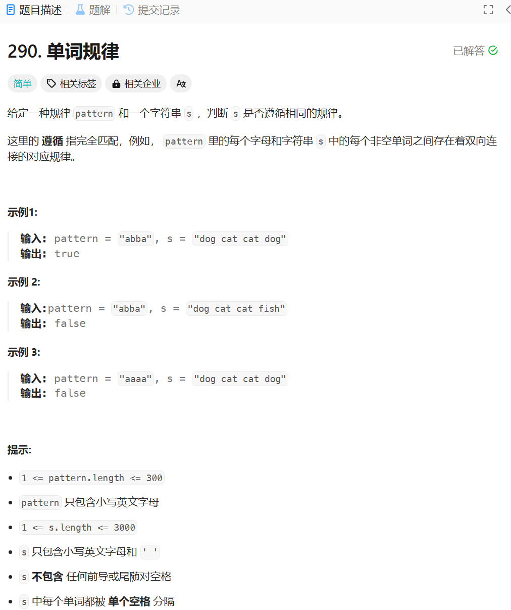

# 290. 单词规律
## 题目链接  
[290. 单词规律](https://leetcode.cn/problems/word-pattern/description/)
## 题目详情


***
## 解答一
答题者：**Yuiko630**

## 题解
>因为字符串s仅由单个空格隔开，先用split转换成数组存放单词，比较单词数量和pattern长度不一直接返回false，然后用map记录字母对应的单词，扫描一遍pattern，比较字母与单词是否一一对应即可。

### 代码
``` Java
class Solution {
    public boolean wordPattern(String pattern, String s) {
        String[] words = s.split(" ");
        if(words.length != pattern.length()) return false;
        Map<Character, String> record = new HashMap<Character, String>();
        for(int i = 0; i < pattern.length(); i++){
            if(record.containsKey(pattern.charAt(i))){
                if(!record.get(pattern.charAt(i)).equals(words[i])) return false;
            }
            else{
                if(record.containsValue(words[i])) return false;
                record.put(pattern.charAt(i), words[i]);
            }
        }
        return true;
    }
}
```

***
## 解答二
答题者：**EchoBai**

## 题解
>双射，建立两个map模拟映射过程即可。

### 代码
``` c++
class Solution {
public:
    bool wordPattern(string pattern, string s) {
        vector<string> words;
        fromStringGetWords(s,words);
        if(pattern.size() != words.size()) return false;
        unordered_map<char, string> ctos;
        unordered_map<string, char> stoc;

        for(int i = 0; i < pattern.size(); ++i){
            if(ctos.count(pattern[i]) && ctos[pattern[i]] != words[i] || 
            stoc.count(words[i]) && stoc[words[i]] != pattern[i])
                return false;
            ctos[pattern[i]] = words[i];
            stoc[words[i]] = pattern[i];
        }
        return true;
    }

    void fromStringGetWords(const string& s, vector<string>& words){
        std::istringstream iss(s);
        std::string word;
        while (iss >> word) {
            words.push_back(word);
        }
    }
};
```