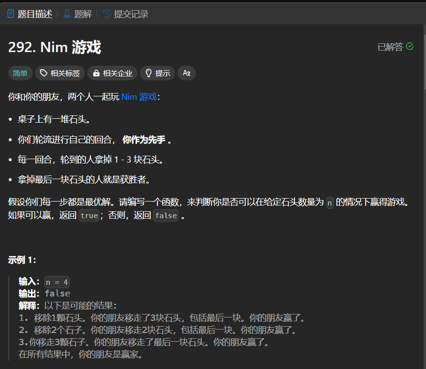

# 292. Nim 游戏
## 题目链接  
[292. Nim 游戏](https://leetcode.cn/problems/nim-game/description/)
## 题目详情


***
## 解答一
答题者：EchoBai

## 题解
首先，小于等于3可以一次性拿走一定是稳赢的，其次题目中第四次是必输的情况，那么考虑数量为5，我们只需要给对手制造数量为4的情况即可，同理6，7都可以制造出数量为4的情况，考虑数量为8时，无论我们拿走1-3中任意数量的，都会转为对手给我们制造出数量为4的情况，导致我们输掉比赛，而9，10，11，我们可以制造数量为8的情况给对手，依次类推，可以发现，如果当前数量为4的倍数，则我们处于必输的局面。具体代码如下。
### 代码
``` cpp
class Solution {
public:
    bool canWinNim(int n) {
        if(n <= 3)
            return true;
        else 
            return n % 4;
    }
};
```