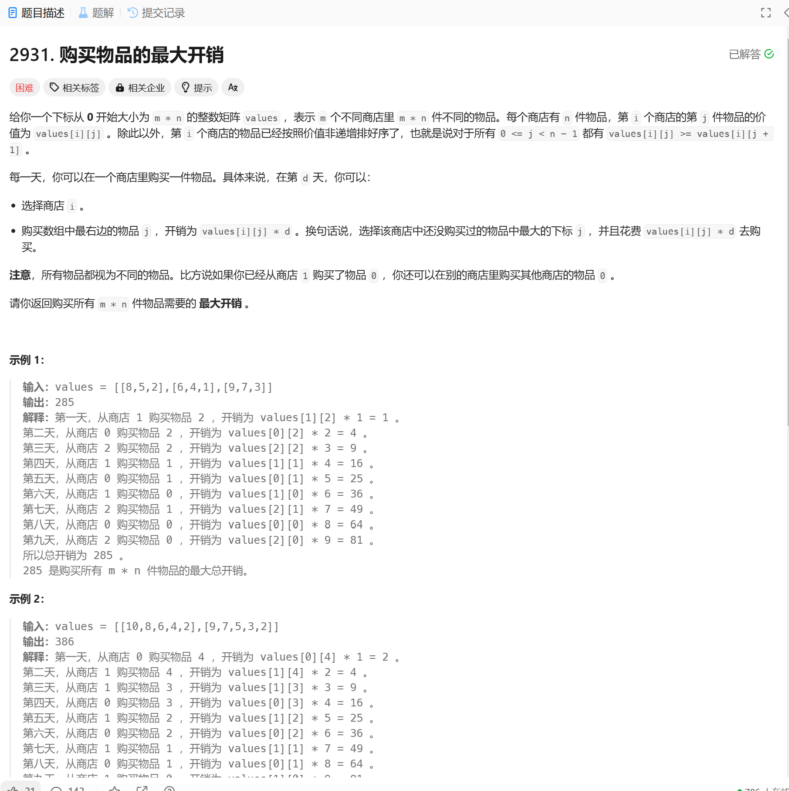

# 2931. 购买物品的最大开销
## 题目链接  
[2931. 购买物品的最大开销](https://leetcode.cn/problems/maximum-spending-after-buying-items/description/?envType=daily-question&envId=2024-12-12)
## 题目详情


***
## 解答一
答题者：**EchoBai**

## 题解
>从数学不等式的角度来说，最大的开销就是天数和商品价格尽量接近平方，每个平方和是最大的。又题目最小的商品位于数组后面，且一定需要先取出，因为一开始天数小，因此商品也要小，于是我们可以将数组展为一维数组然后升序排列，依次相乘即可。
>第二种解法是用一个优先队列，维护一个小根堆，由最小的几个数构成，每次取出堆顶元素（当前最小的数），然后将堆顶元素出栈，判断堆顶元素所在列是否还有数，有则放入堆中，这样可以确保堆中的数一直都是每一行最靠右的数构成。

### 代码
``` c++
class Solution {
public:
    long long maxSpending(vector<vector<int>>& values) {
        int m = values.size();
        int n = values[0].size();
        long long ans = 0;
        priority_queue<std::pair<int,int>, vector<std::pair<int,int>>, greater<>> pq;

        for(int i = 0; i < m; ++i){
            pq.emplace(values[i].back(), i);
        }

        for(int d = 1; d <= m * n; ++d){
            const auto [e, i] = pq.top();
            pq.pop();

            ans += (long long) e * d;
            values[i].pop_back();
            if(!values[i].empty()){
                pq.emplace(values[i].back(), i);
            }
        }

        return ans;
    }

};
```

``` c++
class Solution {
public:
    long long maxSpending(vector<vector<int>>& values) {
        int m = values.size();
        int n = values[0].size();
        vector<int> merge;
        merge.reserve(m * n);
        for(const auto& r : values){
            merge.insert(merge.end(), r.begin(), r.end());
        }

        sort(merge.begin(), merge.end());

        long long ans = 0;
        for(int i = 0; i < merge.size(); ++i){
            ans += (long long)merge[i] * (i + 1);
        }

        return ans;
    }

};
```
