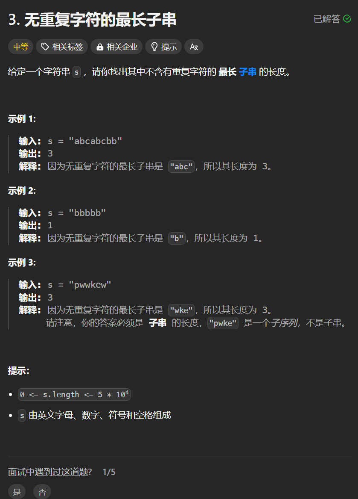

# 3. 无重复字符的最长子串
## 题目链接  
[3. 无重复字符的最长子串](https://leetcode.cn/problems/longest-substring-without-repeating-characters/)
## 题目详情


***
## 解答一
答题者：**Yuiko630**

### 题解
>滑动窗口，用set记录出现过的字符，left指向左边界，right右边界不断尝试扩大，如果扩大不了则缩小左边界。

### 代码
``` Java
class Solution {
    public int lengthOfLongestSubstring(String s) {
        if(s.length() == 0) return 0;
        int maxLength = 0, right = -1;
        Set<Character> record = new HashSet<>();
        for(int left = 0; left < s.length(); left++){
            while(right < s.length() - 1 && !record.contains(s.charAt(right + 1))){
                record.add(s.charAt(right + 1));
                right++;
            }
            maxLength = Math.max(maxLength, right-left+1);
            record.remove(s.charAt(left));
        }
        return maxLength;
    }
}
```