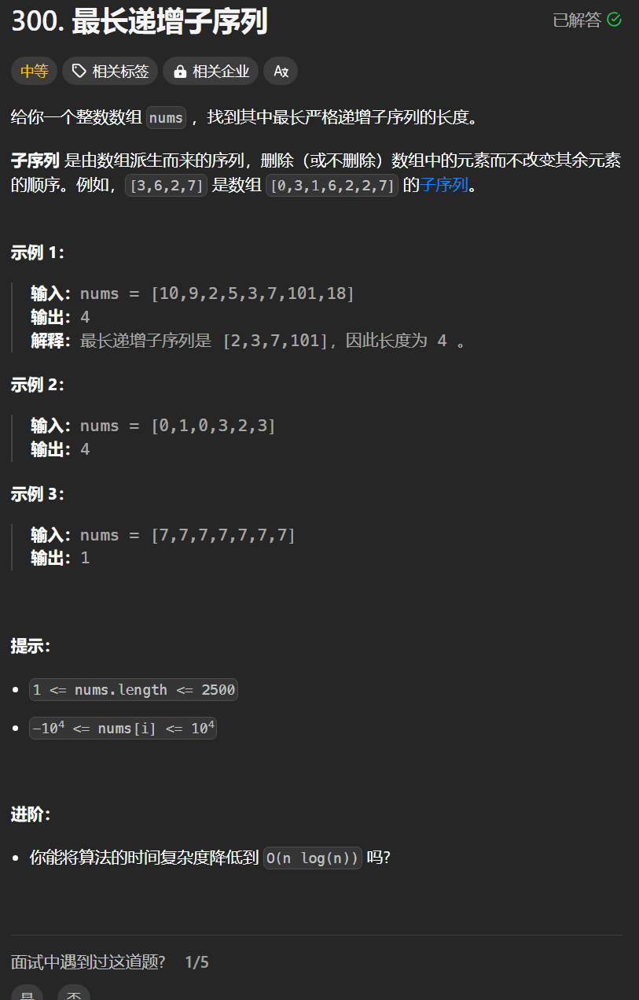

# 300. 最长上升子序列
## 题目链接  
[300. 最长上升子序列](https://leetcode.cn/problems/longest-increasing-subsequence/)
## 题目详情


***
## 解答一
答题者：**Yuiko630**

### 题解
>定义:dp[i]表示包括i在内的最长递增子序列长度
>2. 转移方程:if(nums[i] > nums[j]) dp[i] = max(dp[i], dp[j]+1); 找前面的最大长度+1
>3. 初始化:dp[i][0] = 1; 每个位置初始最长长度均为1
>4. 遍历:外层循环i从1-length-1，内层循环从0-i-1
>5. 推导

### 代码
``` java
class Solution {
    public int lengthOfLIS(int[] nums) {
        int[] dp = new int[nums.length];
        int result = 1;
        for(int i = 0; i < nums.length; i++){
            dp[i] = 1;
        }
        for(int i = 1; i < nums.length; i++){
            for(int j = 0; j < i; j++){
                if(nums[i] > nums[j]) dp[i] = Math.max(dp[i], dp[j] + 1);
            }
            if(dp[i] > result) result = dp[i];
        }
        return result;
    }
}
```