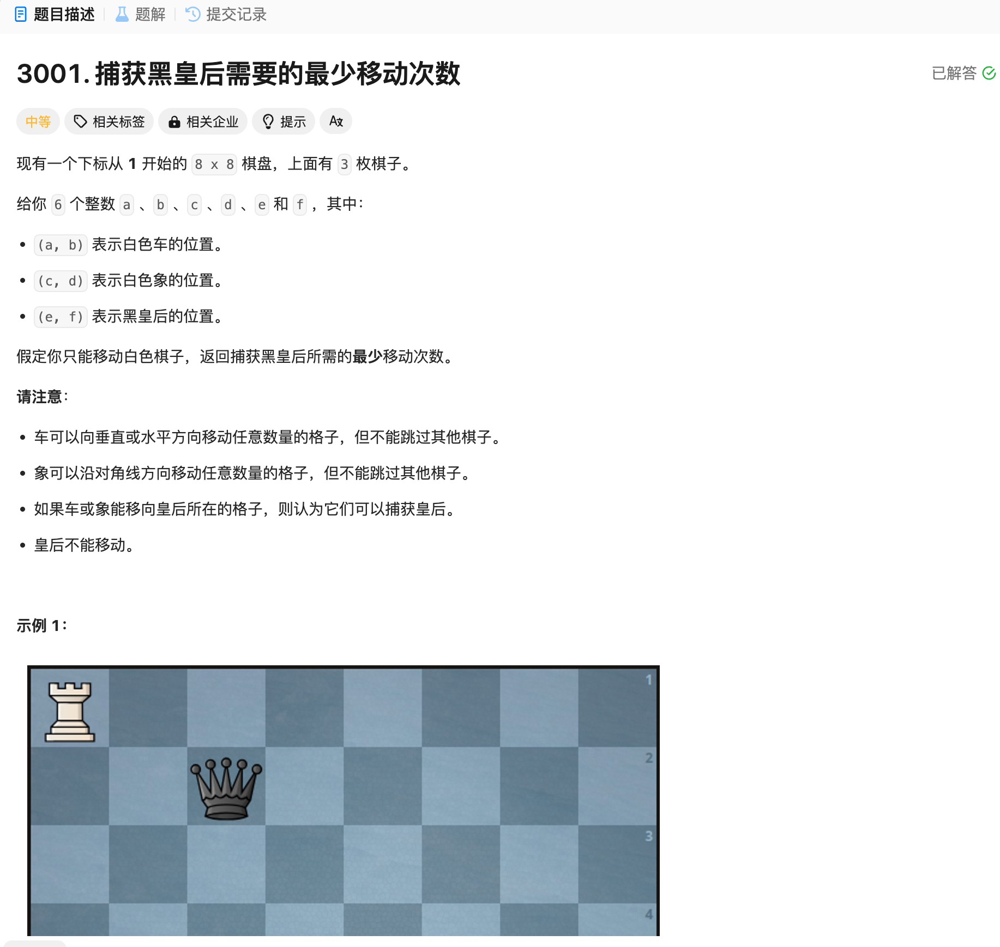

# 3001. 捕获黑皇后需要的最少移动次数
## 题目链接  
[3001. 捕获黑皇后需要的最少移动次数](https://leetcode.cn/problems/minimum-moves-to-capture-the-queen/?envType=daily-question&envId=2024-12-05)
## 题目详情


***
## 解答一
答题者：EchoBai

### 题解
枚举象所有移动路径和坐标，然后判断后是否在路径上，在的话判断是否有车在后前面阻挡，有的话返回false，没有直接返回true。另外需考虑象挡住车的情况，这种情况下就需要排除三者共线，即象处在车前后之后。其实三者都在斜线也可以不用枚举路径，只需考虑坐标间的关系即可。

### 代码
``` cpp
struct Move {
    int x0, y0; // start point
    int dx, dy; // move direction
    int step; // move step
};

class Solution {
    vector<pair<int,int>> DIRS = {{-1, 0}, {1, 0}, {0, -1}, {0, 1}, {1, 1}, {-1, 1}, {-1, -1}, {1, -1}}; // up down left right + 
    unordered_map<char, vector<pair<int, int>>> PIECE_DIRS = {
        {'r', {DIRS.begin(), DIRS.begin() + 4}},
        {'b', {DIRS.begin() + 4, DIRS.end()}},
        {'q', DIRS},
    };

    bool judgeMove(int x0, int y0, vector<pair<int, int>>& dirs,int a, int b, int e, int f){
        const int SIZE = 8;
        for(auto [dx, dy] : dirs){
            int x = x0 + dx, y = y0 + dy;
            bool crash = false;
            for(int step = 1; 0 < x && x <= SIZE && 0 < y && y <= SIZE; ++step){
                if(x == e && y == f && !crash){
                    return true;
                }
                if(x == a && y == b){
                    crash = true;
                }
                x += dx;
                y += dy;
            }
        }
        return false;
    }

public:
    int minMovesToCaptureTheQueen(int a, int b, int c, int d, int e, int f) {
        if(judgeMove(c, d, PIECE_DIRS['b'], a, b, e, f)){
            return 1;
        }
        if((a == e)&& (c == e)){
            if(!((b < d && d < f) || (b > d && d > f))) return 1;
        }else if((b == f)&& (d == f)){
            if(!((a < c && c < e) || (a > c && c > e) )) return 1;
            
        }else if(a == e && c != e || b == f && d != f){
            return 1;
        }
        return 2;
    }
};
```
