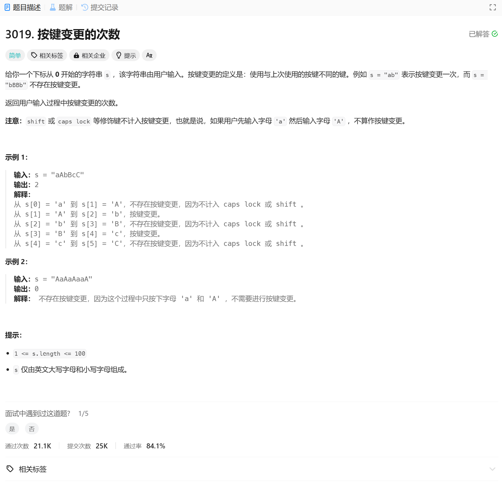

# 3019. 按键变更的次数
## 题目链接  
[3019. 按键变更的次数](https://leetcode.cn/problems/number-of-changing-keys/description/?envType=daily-question&envId=2025-01-07)
## 题目详情


***
## 解答一
答题者：EchoBai

### 题解
当字符不同时次数++即可。

### 代码
``` cpp
class Solution {
public:
    int countKeyChanges(string s) {
        int res = 0;
        int len = s.length();
        if(len < 2) return 0;
        for(int i = 1; i < len; ++i){
            if(std::tolower(s[i]) != std::tolower(s[i - 1])){
                ++res;
            }
        }
        return res;
    }
};
```
