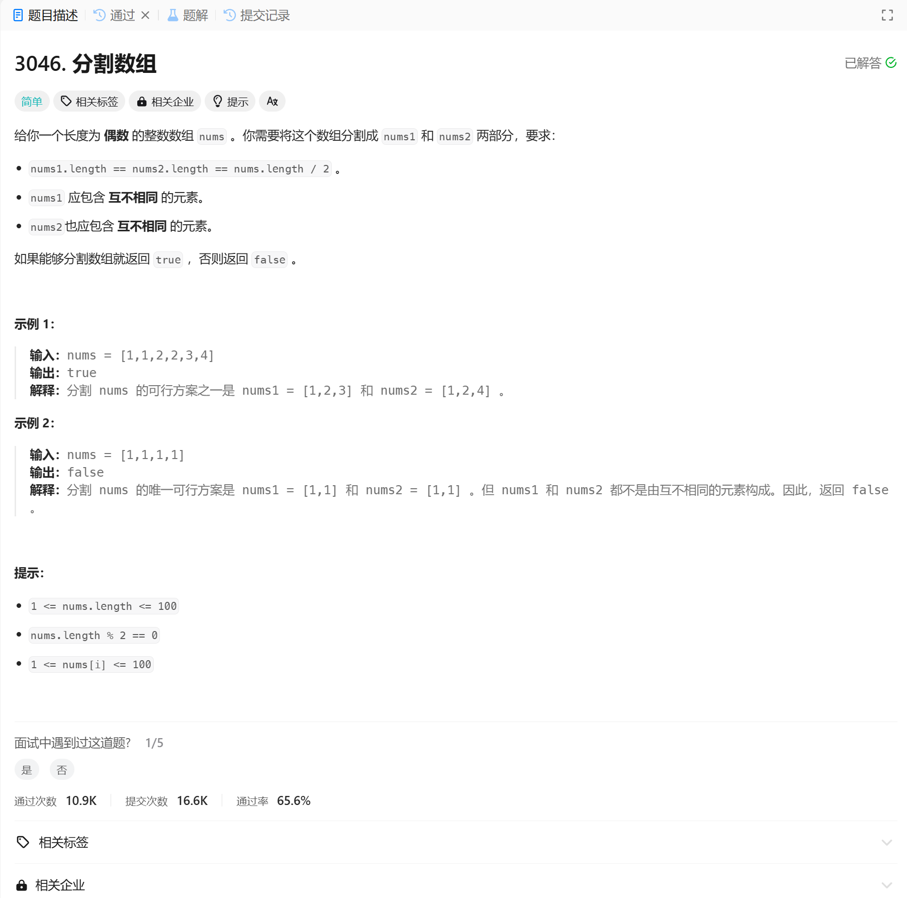

# 3046. 分割数组
## 题目链接  
[3046. 分割数组](https://leetcode.cn/problems/split-the-array/description/?envType=daily-question&envId=2024-12-28)
## 题目详情


***
## 解答一
答题者：EchoBai

### 题解
使用map统计元素出现次数，当发现出现次数大于2，则直接返回false。

### 代码
``` cpp
class Solution {
public:
    bool isPossibleToSplit(vector<int>& nums) {
        map<int,int> mp;
        for(const int& e : nums){
            mp[e]++;
            if(mp[e] > 2){
                return false;
            }
        }
        return true;
    }
};
```
