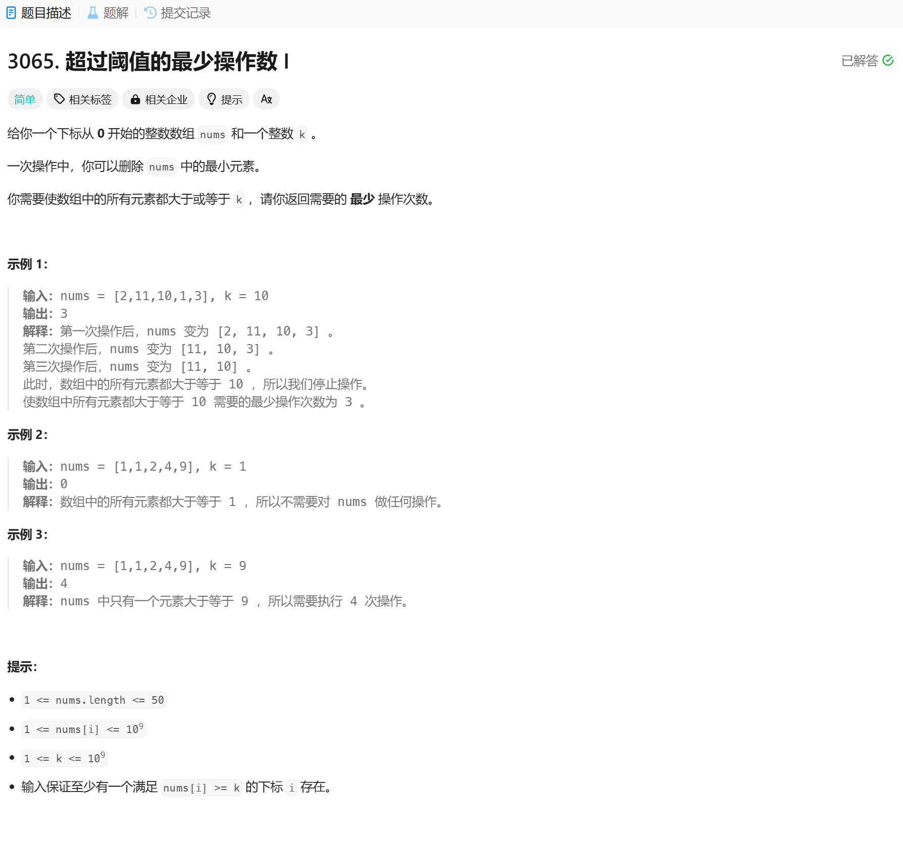

# 3065. 超过阈值的最少操作数 I
## 题目链接  
[3065. 超过阈值的最少操作数 I](https://leetcode.cn/problems/minimum-operations-to-exceed-threshold-value-i/description/?envType=daily-question&envId=2025-01-14)
## 题目详情


***
## 解答一
答题者：EchoBai

### 题解
统计所有小于k的数即可。

### 代码
``` cpp
class Solution {
public:
    int minOperations(vector<int>& nums, int k) {
        int cnt = 0;
        for(const auto& e : nums){
            if(e < k){
                ++cnt;
            }
        }
        return cnt;
    }
};
```
