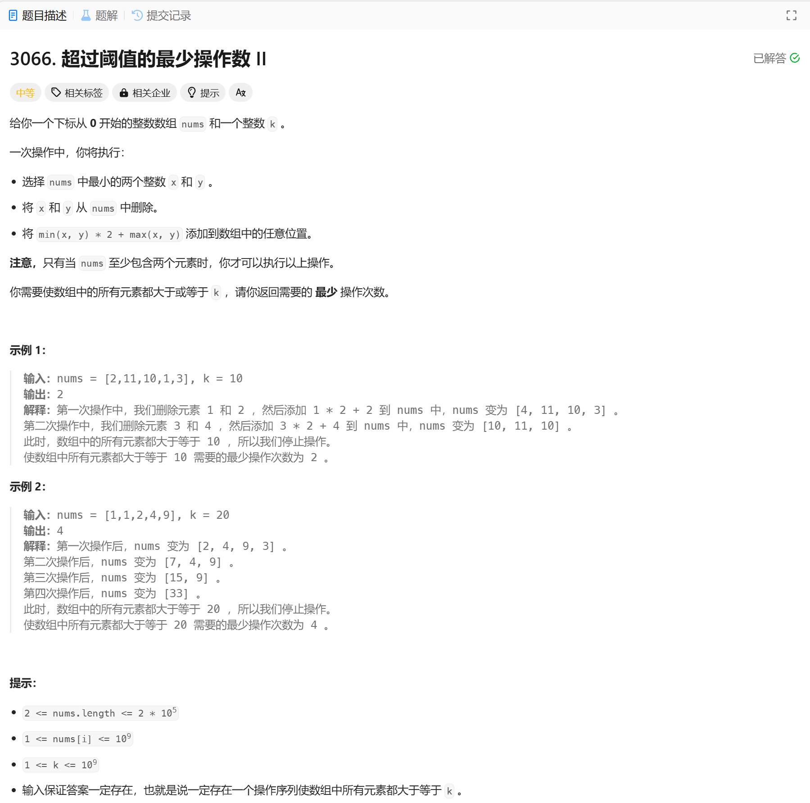

# 3066. 超过阈值的最少操作数 II
## 题目链接  
[3066. 超过阈值的最少操作数 II](https://leetcode.cn/problems/minimum-operations-to-exceed-threshold-value-ii/description/?envType=daily-question&envId=2025-01-15)
## 题目详情


***
## 解答一
答题者：EchoBai

### 题解
使用一个小顶堆每次弹出最上层的两个，按题目要求计算新的数放入，操作次数++，当堆顶元素大于k即可返回。

### 代码
``` cpp
class Solution {
public:
    int minOperations(vector<int>& nums, int k) {
        int size = nums.size();
        if(size < 2) return 0;
        std::priority_queue<long long, vector<long long>, greater<long long>> pq(nums.begin(), nums.end());
        int cnt = 0;
        while(pq.size() >= 2){
            long long e1 = pq.top();
            if(e1 >= k) break;
            pq.pop();
            long long e2 = pq.top();
            pq.pop();
            pq.push(e1 * 2 + e2);
            ++cnt;
        }
        return cnt;
    }
};
```
