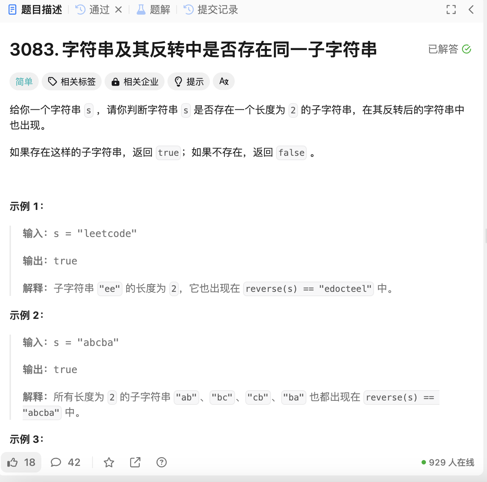

# 3083. 字符串及其反转中是否存在同一子字符串
## 题目链接  
[3083. 字符串及其反转中是否存在同一子字符串](https://leetcode.cn/problems/existence-of-a-substring-in-a-string-and-its-reverse/description/?envType=daily-question&envId=2024-12-26)
## 题目详情


***
## 解答一
答题者：EchoBai

### 题解
用一个map统计字符串中所有长度为2字符串出现的次数，然后反转字符串，如果反转后的字符串仍然出现，那么可以判断该字符串在前后均出现。

### 代码
``` cpp
class Solution {
public:
    bool isSubstringPresent(string s) {
        int len = s.length();
        if(len < 2) return false;
        map<string,int>mp;
        for(int i = 0; i < len - 1; ++i){
            string str = s.substr(i, 2);
            mp[str]++;
        }

        reverse(s.begin(), s.end());
        for(int i = 0; i < len - 1; ++i){
            string tmp = s.substr(i,2);
            if(mp[tmp] > 0){
                return true;
            }
        }

        return false;
    }
};
```
