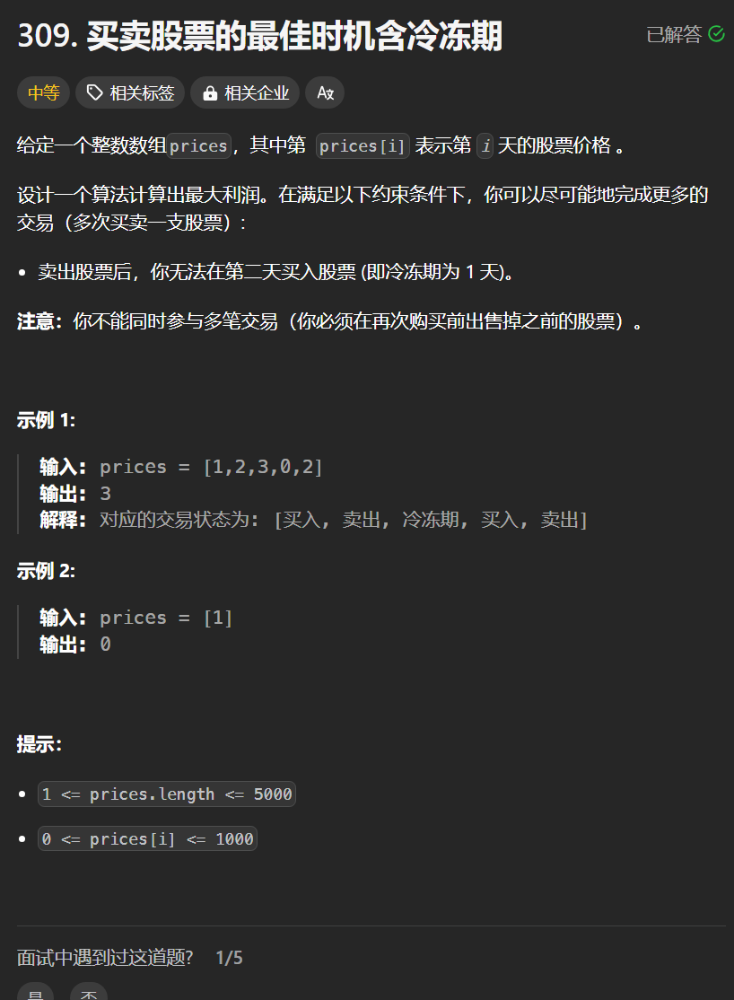

# 309. 买股票的最佳时机 V
## 题目链接  
[309. 买股票的最佳时机 V](https://leetcode.cn/problems/best-time-to-buy-and-sell-stock-v/)
## 题目详情


***
## 解答一
答题者：**Yuiko630**

### 题解
>定义:dp[i][4]，dp[i][0]表示持有股票，dp[i][1]表示不持有股票，dp[i][2]表示卖出股票，dp[i][2]表示冷冻期
>2. 转移方程:
> > 持有：dp[i][0] = Math.max(dp[i-1][0], dp[i-1][1] - prices[i], dp[i-1][3] - prices[i]); 昨天持有或者今天买入或者昨天冷冻期完今天买入
> > 不持有：dp[i][1] = Math.max(dp[i-1][1], dp[i-1][3]); 昨天不持有或者昨天冷冻期
> > 卖出：dp[i][2] = dp[i-1][0]+prices[i]; 表示昨天持有今天卖出
> > 冷冻期：dp[i][3] = dp[i-1][2]; 昨天卖出今天冷冻
>3. 初始化:dp[0][0] = -prices[0];
>4. 遍历:正序遍历prices即可
>5. 推导

### 代码
``` java
class Solution {
    public int maxProfit(int[] prices) {
        int length = prices.length;
        int[][] dp = new int[length][4];
        dp[0][0] -= prices[0];
        for(int i = 1; i < length; i++){
            dp[i][0] = Math.max(Math.max(dp[i-1][0], dp[i-1][1] - prices[i]), dp[i-1][3] - prices[i]);
            dp[i][1] = Math.max(dp[i-1][1], dp[i-1][3]);
            dp[i][2] = dp[i-1][0] + prices[i];
            dp[i][3] = dp[i-1][2];
        }
        return Math.max(dp[length - 1][3], Math.max(dp[length - 1][1], dp[length - 1][2]));
    }
}
```