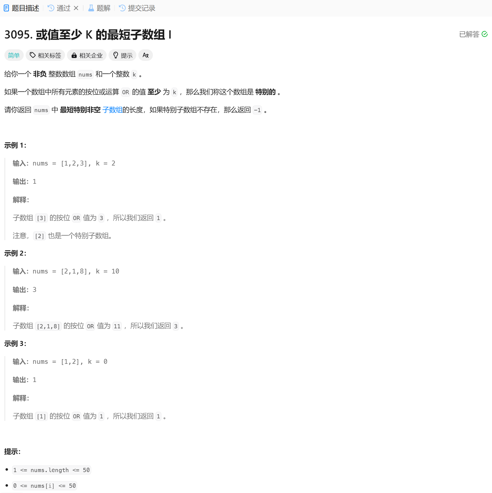

# 3095. 或值至少 K 的最短子数组 I
## 题目链接  
[3095. 或值至少 K 的最短子数组 I](https://leetcode.cn/problems/shortest-subarray-with-or-at-least-k-i/description/?envType=daily-question&envId=2025-01-16)
## 题目详情


***
## 解答一
答题者：EchoBai

### 题解
暴力搜素即可。

### 代码
``` cpp
class Solution {
public:
    int minimumSubarrayLength(vector<int>& nums, int k) {
        int minlen = INT_MAX;
        for(int i = 0; i < nums.size(); ++i){
            int res = 0;
            int len = 0;
            for(int j = i; j < nums.size(); ++j){
                if(nums[j] >= k){
                    return 1;
                }
                res |= nums[j];
                ++len;
                if(res >= k){
                    minlen = std::min(minlen, len);
                    break;
                }
            }   
        }
        return minlen == INT_MAX? -1 : minlen;
    }
};
```
