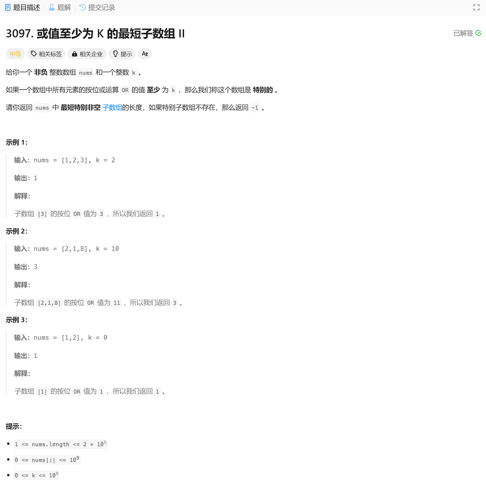

# 3097. 或值至少为 K 的最短子数组 II
## 题目链接  
[3097. 或值至少为 K 的最短子数组 II](https://leetcode.cn/problems/shortest-subarray-with-or-at-least-k-ii/description/?envType=daily-question&envId=2025-01-17)
## 题目详情


***
## 解答一
答题者：EchoBai

### 题解
滑动窗口，需要注意的时由于or操作不具有可逆性，也即当我们想要移除左端点的值时，不存在逆操作，因此我们统计当前窗口每一位1的个数，然后在移除左端点的时候把其对应贡献剪去，如果变为0，那么直接将异或值对应位置为0即可。

### 代码
``` cpp
class Solution {
public:
    int minimumSubarrayLength(vector<int>& nums, int k) {
        int minlen = INT_MAX;
        int left = 0;
        vector<int> bits(30);
        std::bitset<30> res;
        for(int right = 0; right < nums.size(); ++right){
            for(int i = 0; i < 30; ++i){
                if((nums[right] >> i) & 1){
                    bits[i]++;
                    res[i] = 1;
                }
            }
            if(nums[right] >= k){
                return 1;
            }
            while(left <= right && res.to_ulong() >= k){
                minlen = std::min(minlen, right - left + 1);
                for(int i = 0; i < 30; ++i){
                    if((nums[left] >> i) & 1){
                        if(--bits[i] == 0)
                            res[i] = 0;
                    }
                }
                ++left;
            }
        }
        return minlen == INT_MAX? -1 : minlen;
    }
};
```
