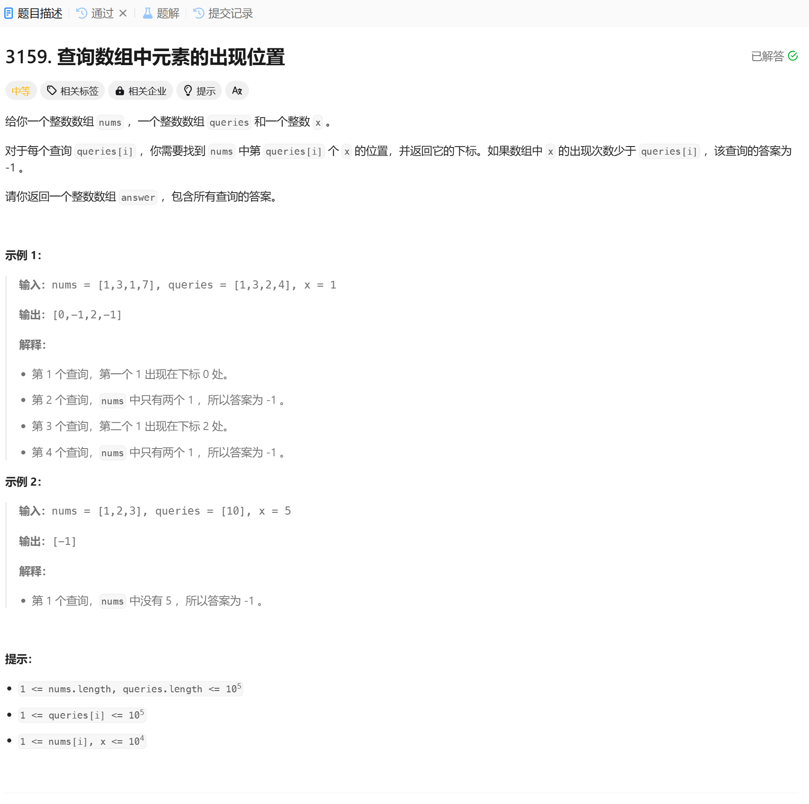

# 3159. 查询数组中元素的出现位置
## 题目链接  
[3159. 查询数组中元素的出现位置](https://leetcode.cn/problems/find-occurrences-of-an-element-in-an-array/description/?envType=daily-question&envId=2024-12-27)
## 题目详情


***
## 解答一
答题者：EchoBai

### 题解
首先使用map统计每个x出现的位置，记录位置信息，然后遍历queries数组，根据当前值判断是否存在在map中，如果存在则将对应位置的信息压入vector，否则压入-1。

### 代码
``` cpp
class Solution {
public:
    vector<int> occurrencesOfElement(vector<int>& nums, vector<int>& queries, int x) {
        std::map<int,int> mp;
        int loc = 1;
        for(int i = 0; i < nums.size(); ++i){
            if(nums[i] == x){
                mp[loc] = i;
                ++loc;
            }
        }

        vector<int> res;
        for(int i = 0; i < queries.size(); ++i){
            if(queries[i] < loc){
                res.push_back(mp[queries[i]]);
            }else{
                res.push_back(-1);
            }
        }
        return res;
    }
};
```
