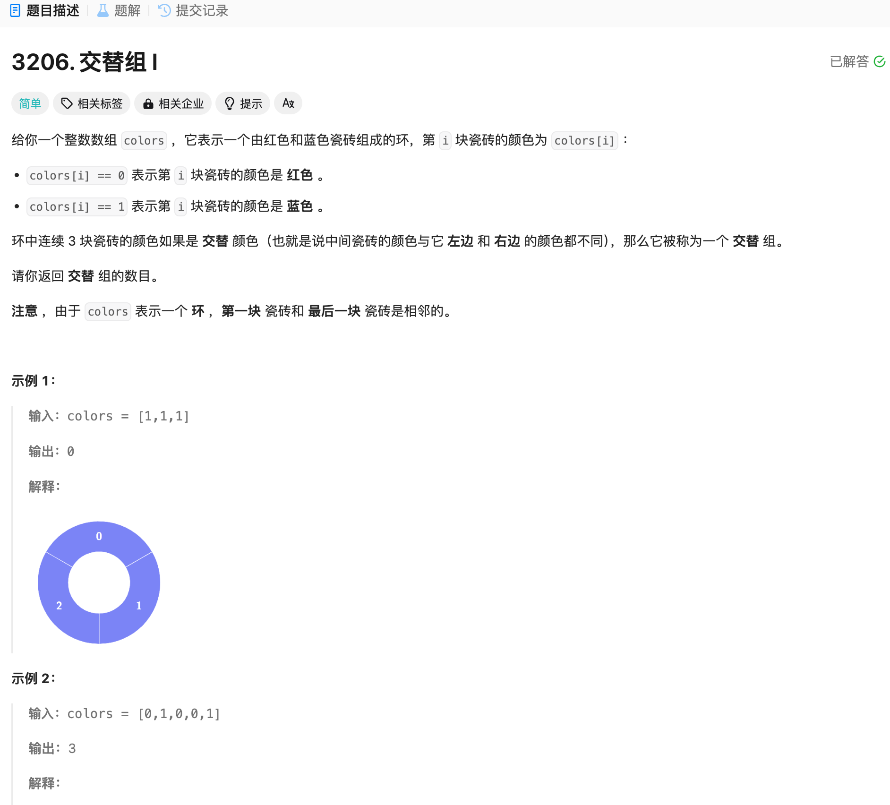

# 3206. 交替组 I
## 题目链接  
[3206. 交替组 I](https://leetcode.cn/problems/alternating-groups-i/description/?envType=daily-question&envId=2024-11-26)
## 题目详情


***
## 解答一
答题者：EchoBai

### 题解
遍历环形数组找出满足条件的子序列即可。注意遍历结束的条件以及不要让数组访问越界。

### 代码
``` cpp
class Solution {
public:
    int numberOfAlternatingGroups(vector<int>& colors) {
        int csize = colors.size();
        int i = 0;
        int res = 0;
        do {
            int next1 = (i + 1) % csize;
            int next2 = (i + 2) % csize;
            if(colors[i] != colors[next1] && colors[next1] != colors[next2]){
                ++res;
            }
            i = next1;
        }while(i != 0);
        return res;
    }
};
```
