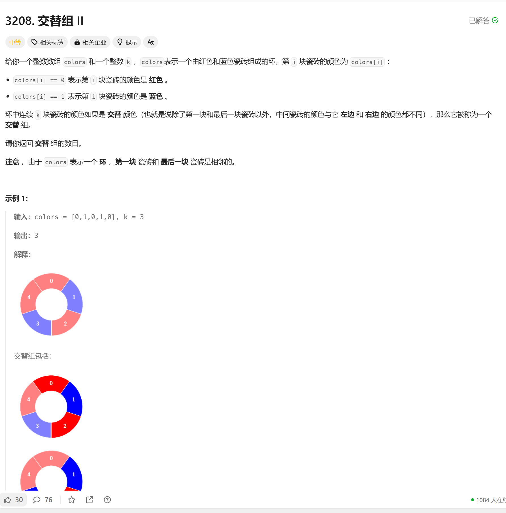

# 3208. 交替组 II
## 题目链接  
[3208. 交替组 II](https://leetcode.cn/problems/alternating-groups-ii/description/?envType=daily-question&envId=2024-11-27)
## 题目详情


***
## 解答一
答题者：EchoBai

### 题解
遍历环形数组，如果直接循环检查的话很容易超时（注释部分的代码），因为每次都要重新检查，但是有些公共的部分是不需要重复检查的，因此引入一个滑动窗口，如果数字相互交替，那么窗口一直增大，满足题目要求的长度后，就统计次数++，同时窗口值--，相当于直接右移，这样就不会重复检测了。当遍历遇到相同的，则窗口大小归0。

### 代码
``` cpp
class Solution {
public:
    int numberOfAlternatingGroups(vector<int>& colors, int k) {
        int res = 0;
        //int i = 0;
        int size = colors.size();
        // do {
        //     int next = (i + 1) % size;
        //     bool isSame = true;
        //     for(int j = 0; j < (k - 1); ++j){
        //         int next1 = (j + i) % size;
        //         int next2 = (j + i + 1) % size;
        //         if(colors[next1] == colors[next2]){
        //             isSame = false;
        //             break;
        //         }
        //     }
        //     if(isSame){
        //         ++res;
        //     }
        //     i = next;
            
        // }while(i != 0);
        int cnt = 0;
        for(int i = 0; i < size + k - 2; ++i){
            int cur = colors[i % size];
            int next = colors[(i + 1) % size];
            //std::cout << "(cur, next)"  << "(" << i % size << "," << (i + 1) % size  << ")" << std::endl;
            if(cur != next){
                ++cnt;
                if(cnt == (k - 1)){
                    ++res;
                    //std::cout << "cnt: " << cnt << std::endl;
                    --cnt;
                }
            }else{
                cnt = 0;
            }
        }
        return res;
        
    }
};
```
