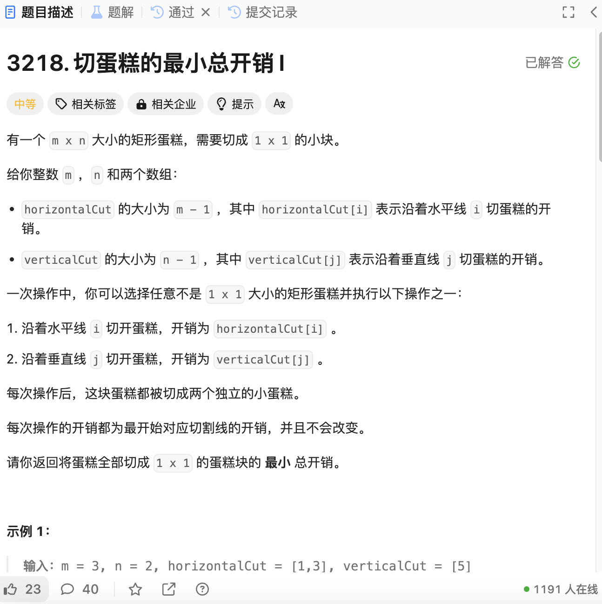

# 3219. 切蛋糕的最小总开销 II
## 题目链接  
[3219. 切蛋糕的最小总开销 II](https://leetcode.cn/problems/minimum-cost-for-cutting-cake-ii/description/)
## 题目详情


***
## 解答一
答题者：EchoBai

### 题解
将切割所需花费从大到小排序，优先把切割消耗大的操作进行，这样后续就算要切割多次肯定也是消耗小的，在一开始初始化水平切割线，垂直切割线总数均为1。每次水平切割会增加一条水平切割线，同时所需总开销为单步切割开销*垂直线的数量。

### 代码
``` cpp
class Solution {
public:
    int minimumCost(int m, int n, vector<int>& horizontalCut, vector<int>& verticalCut) {
        std::vector<std::pair<int,char>> vt;
        for(const int h : horizontalCut){
            vt.emplace_back(h, 'H');
        }
        for(const int v : verticalCut){
            vt.emplace_back(v, 'V');
        }

        sort(vt.begin(),vt.end(),[](const std::pair<int,char>& a, const std::pair<int,char>& b){
            return a.first > b.first;
        });

        int hlines = 1;
        int vlines = 1;
        int res = 0;

        for(const auto[cut, dir] : vt){
            if(dir == 'H'){
                res += cut * vlines;
                ++hlines;
            }else{
                res += cut * hlines;
                ++vlines;
            }
        }
        return res;
    }
};
```
