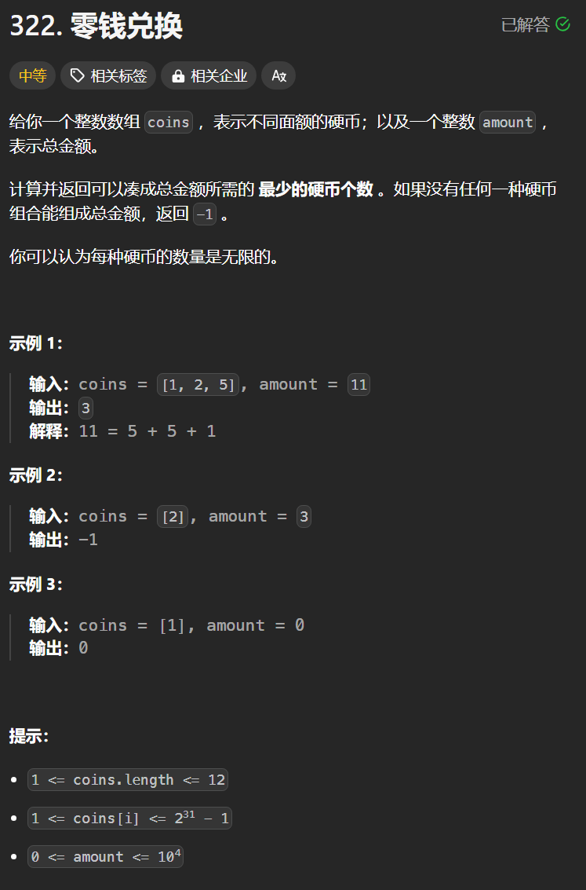

# 322. 零钱兑换
## 题目链接  
[322. 零钱兑换](https://leetcode.cn/problems/coin-change/description/)
## 题目详情


***
## 解答一
答题者：**Yuiko630**

### 题解
>dp，五部曲
>1. 定义:dp[j]表示凑成j最少需要dp[j]个硬币
>2. 转移方程:dp[j] = min(dp[j-coins[i]]+1, dp[j])
>3. 初始化:dp[0]=0，凑成0不需要硬币，dp[非0]=Integer.MAX_VALUE，因为是要找最少个数，所以全部初始化为最大的，注意若为最大值跳过转移
>4. 遍历:组合问题外层遍历coins，内层遍历coins[i]-amount
>5. 推导

### 代码
``` Java
class Solution {
    public int coinChange(int[] coins, int amount) {
        int[] dp = new int[amount + 1];
        for (int j = 1; j < dp.length; j++) {
            dp[j] = Integer.MAX_VALUE;
        }
        dp[0] = 0;
        for(int i = 0; i < coins.length; i++){
            for(int j = coins[i]; j <= amount; j++){
                if(dp[j-coins[i]] != Integer.MAX_VALUE)
                    dp[j] = Math.min(dp[j], dp[j-coins[i]] + 1);
            }
        }
        return dp[amount] == Integer.MAX_VALUE? -1: dp[amount];
    }
}
```