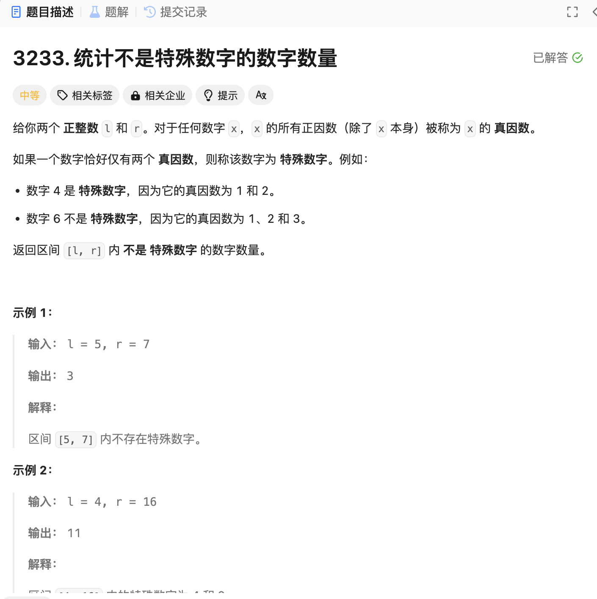

# 3233. 统计不是特殊数字的数字数量
## 题目链接  
[3233. 统计不是特殊数字的数字数量](https://leetcode.cn/problems/find-the-count-of-numbers-which-are-not-special/description/?envType=daily-question&envId=2024-11-22)
## 题目详情


***
## 解答一
答题者：EchoBai

### 题解
注意到除开自身的话，那么特殊数字的因数只有2个，素数的因数只有一个，那么把素数平方一定是个特殊数字。因此只需要找出小于r的所有素数，检查他们的平方是否在区间内，然后统计个数，最后用区间长度减去特殊数字的个数即可。

### 代码
``` cpp
class Solution {
public:
    int nonSpecialCount(int l, int r) {
        int cnt = 0;
        std::vector<int> prime;
        for(int i = 2; i <= sqrt(r); ++i){
            if(isPrime(i)){
                prime.emplace_back(i);
            }
        }
        for(const auto& e : prime){
            int tmp = e * e;
            if(tmp >= l && tmp <= r){
                ++cnt;
            }else if(tmp > r){
                break;
            }
        }
        return r - l + 1 - cnt;
    }

    bool isPrime(int n) {
        if (n <= 1) return false;
        if (n <= 3) return true;
        if (n % 2 == 0 || n % 3 == 0) return false;
        for (int i = 5; i * i <= n; i += 6) {
            //the count from 5 increase, so 5, 11, 17... is 6n - 1, and the 7, 13, 19... is 6n + 1 
            if (n % i == 0 || n % (i + 2) == 0) return false;
        }
        return true;
    }
};
```


