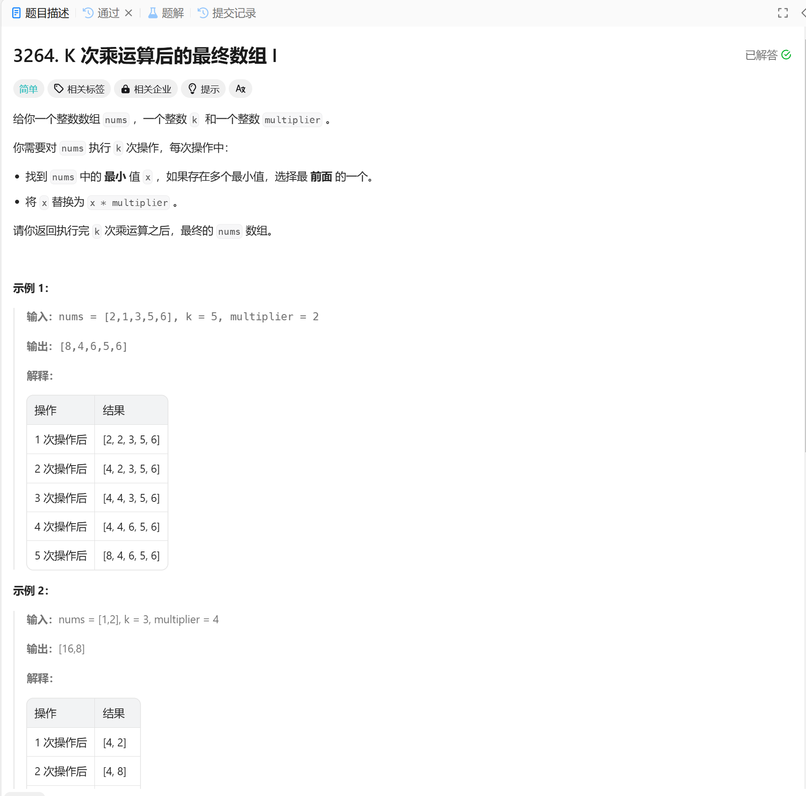

# 3264. K 次乘运算后的最终数组 I
## 题目链接  
[3264. K 次乘运算后的最终数组 I](https://leetcode.cn/problems/final-array-state-after-k-multiplication-operations-i/description/?envType=daily-question&envId=2024-12-13)
## 题目详情


***
## 解答一
答题者：EchoBai

### 题解
按照提议，直接循环k次，每次找出最小值下标重新赋值即可。

### 代码
``` cpp
class Solution {
public:
    vector<int> getFinalState(vector<int>& nums, int k, int multiplier) {
        for(int i = 0; i < k; ++i){
            int minIdx = std::min_element(nums.begin(), nums.end()) - nums.begin();
            nums[minIdx] *= multiplier;
        }
        return nums;
    }
};
```
