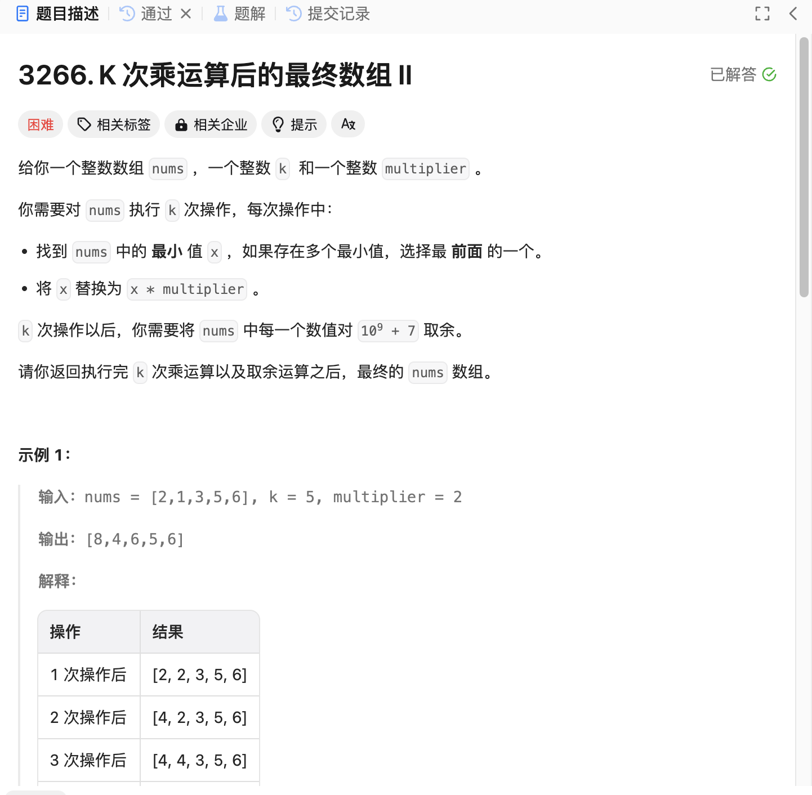

# 3266. K 次乘运算后的最终数组 II
## 题目链接  
[3266. K 次乘运算后的最终数组 II](https://leetcode.cn/problems/final-array-state-after-k-multiplication-operations-ii/description/?envType=daily-question&envId=2024-12-14)
## 题目详情


***
## 解答一
答题者：EchoBai

### 题解
维护一个小根堆，这样每次堆顶的元素一定就是最小的元素，直接按题意进行模拟，当进行k次或者堆中的最小元素已经比原先数组中的最大元素还要大时，我们就停下，如果k还有剩余，那么每进行一次操作就相当于对数组中的元素做一次乘法，考虑剩余k很大的情况，相当于计算 a^(remian(k)/size + 1) % mod。对于这一部分，传统的连乘操作容易超时，因此我们直接用一个快速幂算法来计算该部分结果。

### 代码
``` cpp
class Solution {
    const int MOD = 1000000007;
public:
    vector<int> getFinalState(vector<int>& nums, int k, int multiplier) {
        if(multiplier == 1) return nums;
        long long size = nums.size();
        long long m = *max_element(nums.begin(), nums.end());
        std::priority_queue<std::pair<long,int>, vector<std::pair<long,int>>, greater<>> pq;
        for(int i = 0; i < size; ++i){
            pq.emplace(nums[i], i);
        }
        while(k > 0 && pq.top().first < m){
            auto p = pq.top();
            pq.pop();
            p.first *= multiplier;
            pq.emplace(p);
            --k;
        }

        // quick compute (a^n % mod)
        auto qpow = [&](long long a, long long n, long long mod) {
            long long ans = 1 % mod;
            a = a % mod;
            while (n > 0) {
                if (n & 1) {
                    ans = ans * a % mod;
                }
                a = a * a % mod;
                n >>= 1;
            }
            return ans;
        };

        for (int i = 0; i < size; ++i) {
            auto [x, j] = pq.top();
            pq.pop();
            nums[j] = static_cast<int>((x % MOD) * qpow(multiplier, k / size + (i < k % size ? 1 : 0), MOD) % MOD);
        }
        return nums;
    }
};
```
