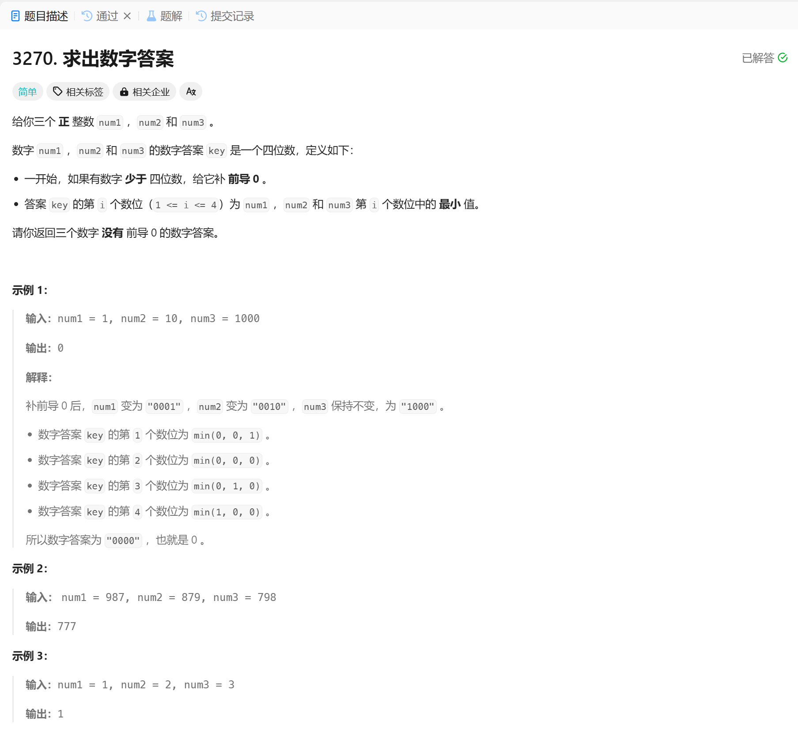

# 3270. 求出数字答案
## 题目链接  
[3270. 求出数字答案](https://leetcode.cn/problems/find-the-key-of-the-numbers/description/?envType=daily-question&envId=2025-01-11)
## 题目详情


***
## 解答一
答题者：EchoBai

### 题解
求出每个数字，然后按题意计算出即可。

### 代码
``` cpp
class Solution {
public:
    int generateKey(int num1, int num2, int num3) {
        int res = 0;
        int mul = 1000;
        for (int i = 1; i <= 4; ++i) {
            int val = std::min(getBits(num1, i), std::min(getBits(num2, i), getBits(num3, i)));
            res += val * mul;
            mul /= 10;
        }
        return res;
    }

    int getBits(int num, int idx) {
        int digits[] = {num / 1000, (num / 100) % 10, (num / 10) % 10, num % 10};
        return digits[idx - 1]; 
    }
};
```
