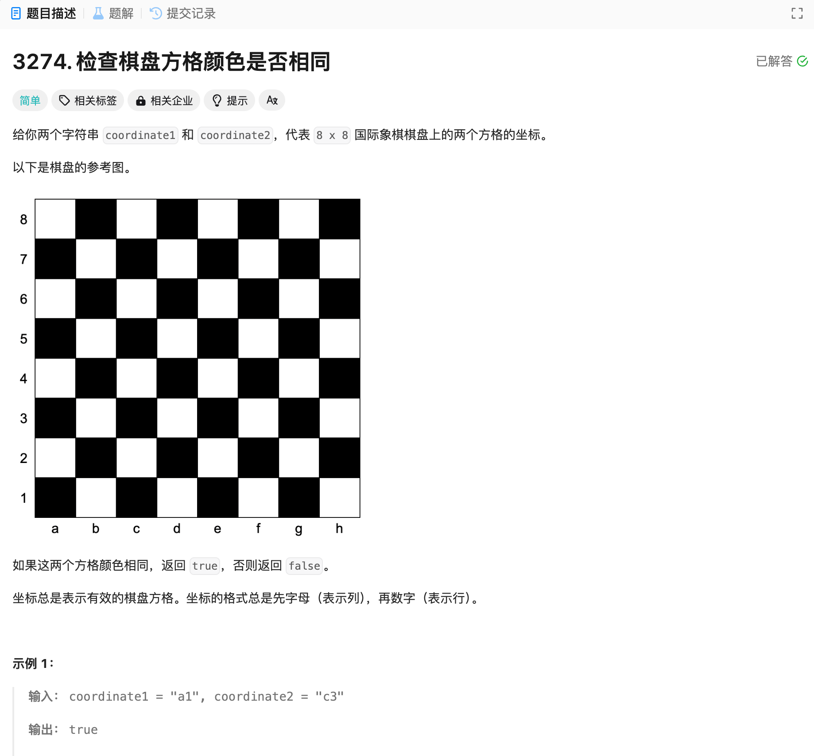

# 3274. 检查棋盘方格颜色是否相同
## 题目链接  
[3274. 检查棋盘方格颜色是否相同](https://leetcode.cn/problems/check-if-two-chessboard-squares-have-the-same-color/description/?envType=daily-question&envId=2024-12-03)
## 题目详情


***
## 解答一
答题者：EchoBai

### 题解
将行列转化为数字坐标，分析就可以发现，坐标全是奇数或者全是偶数都是黑色，一奇数一偶数则全是白色，其余情况颜色不同。

### 代码
``` cpp
class Solution {
public:
    bool checkTwoChessboards(string coordinate1, string coordinate2) {
        int col1 = coordinate1[0] - 'a' + 1;
        int row1 = coordinate1[1] - '0';
        int col2 = coordinate2[0] - 'a' + 1;
        int row2 = coordinate2[1] - '0';
        // black (odd, odd) or (even, even)
        if((col1 % 2 == 1 && row1 % 2 == 1) || (col1 % 2 == 0 && row1 % 2 == 0)){
            if((col2 % 2 == 1 && row2 % 2 == 1) || (col2 % 2 == 0 && row2 % 2 == 0)){
                return true;
            }
        }
        //white (odd,even) or (even,odd)
        if((col1 % 2 == 1 && row1 % 2 == 0) || (col1 % 2 == 0 && row1 % 2 == 1)){
            if((col2 % 2 == 1 && row2 % 2 == 0) || (col2 % 2 == 0 && row2 % 2 == 1)){
                return true;
            }
        }
        return false;
    }
};
```
