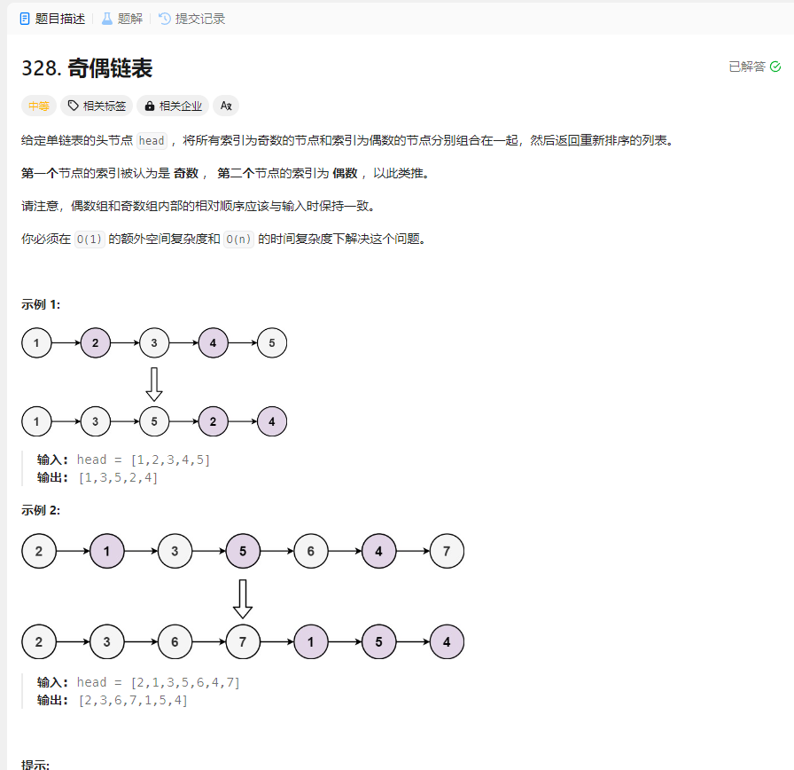

# 328. 奇偶链表
## 题目链接  
[328. 奇偶链表](https://leetcode.cn/problems/odd-even-linked-list/description/)
## 题目详情


***
## 解答一
答题者：EchoBai

### 题解
分别用两个指针链接起来就行，需要注意的是当在链接`odd`时，不能直接用`odd->next = p`。因为这样的话p中含有之前链表的信息没有消去，如果最后在执行`even->next = o->next`时就会导致链表指向自己。造成错误。

### 代码
``` cpp
/**
 * Definition for singly-linked list.
 * struct ListNode {
 *     int val;
 *     ListNode *next;
 *     ListNode() : val(0), next(nullptr) {}
 *     ListNode(int x) : val(x), next(nullptr) {}
 *     ListNode(int x, ListNode *next) : val(x), next(next) {}
 * };
 */
class Solution {
public:
    ListNode* oddEvenList(ListNode* head) {
        if(!head || !head->next) return head;
        ListNode* p = head;
        ListNode* odd = new ListNode(-1);
        ListNode* even = new ListNode(-1);
        ListNode* o = odd;
        head = even;
        int flag = 1;
        while(p){
            if(flag == 0){
                ListNode* t = new ListNode(p->val);
                odd->next = t;
                odd = odd->next;
            }else{
                even->next = p;
                even = even->next;
            }
            flag = !flag;
            p = p->next;
        }
        if(o->next)
            even->next = o->next;
        return head->next;
    }
};
```


