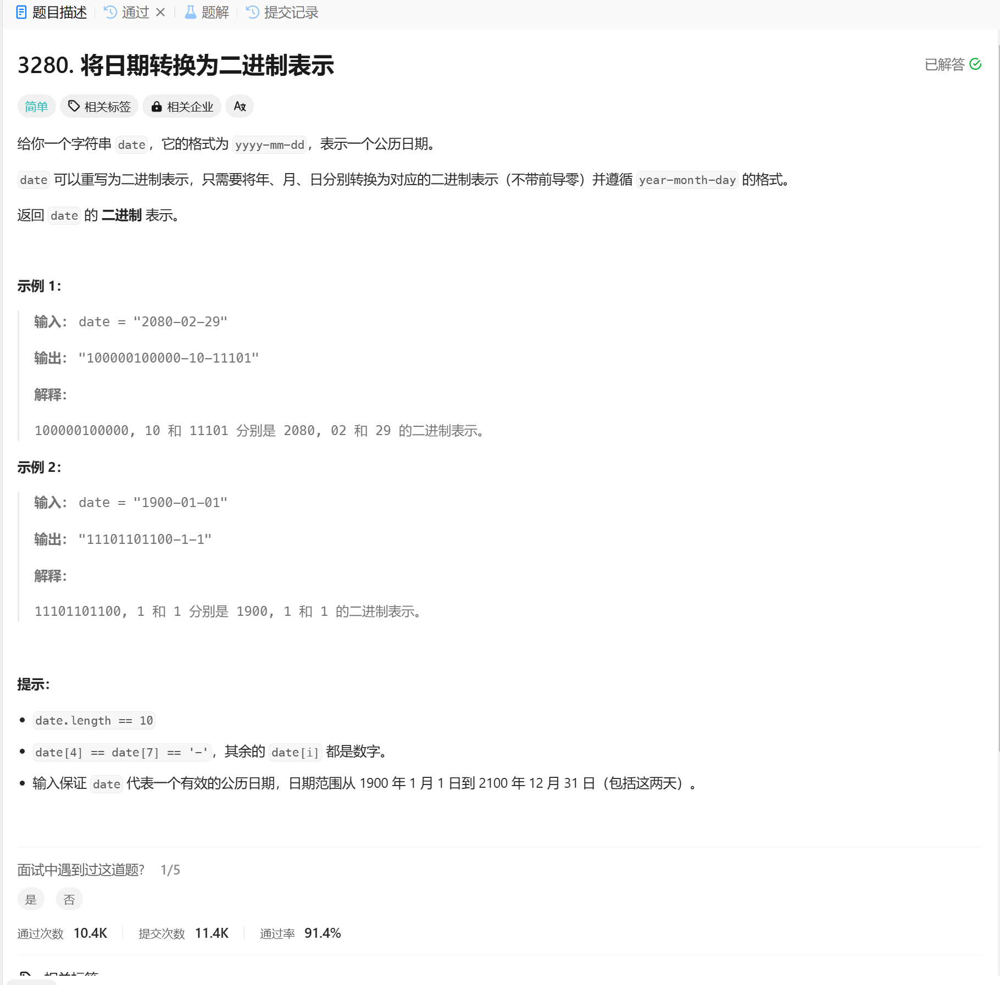

# 3280. 将日期转换为二进制表示
## 题目链接  
[3280. 将日期转换为二进制表示](https://leetcode.cn/problems/convert-date-to-binary/?envType=daily-question&envId=2025-01-01)
## 题目详情


***
## 解答一
答题者：EchoBai

### 题解
先切分字符串为单个字符串，然后分别转为二进制，最后在拼接起来即可。

### 代码
``` cpp
class Solution {
public:
    string convertDateToBinary(string date) {
        std::vector<std::string> tokens;
        std::istringstream tokenStream(date);
        std::string token;

        while (std::getline(tokenStream, token, '-')) {
            token.erase(0, token.find_first_not_of('0'));
            tokens.push_back(token);
        }

        for(int i = 0; i < tokens.size(); ++i){
            tokens[i] = toBinary(stoi(tokens[i]));
        }

        return tokens[0] + "-" + tokens[1] + "-" + tokens[2];

    }

    std::string toBinary(unsigned int num) {
        std::string binary = "";
        while (num > 0) {
            binary = char('0' + (num & 1)) + binary;  
            num >>= 1; 
        }
        return binary.empty() ? "0" : binary;  
    }
};
```
