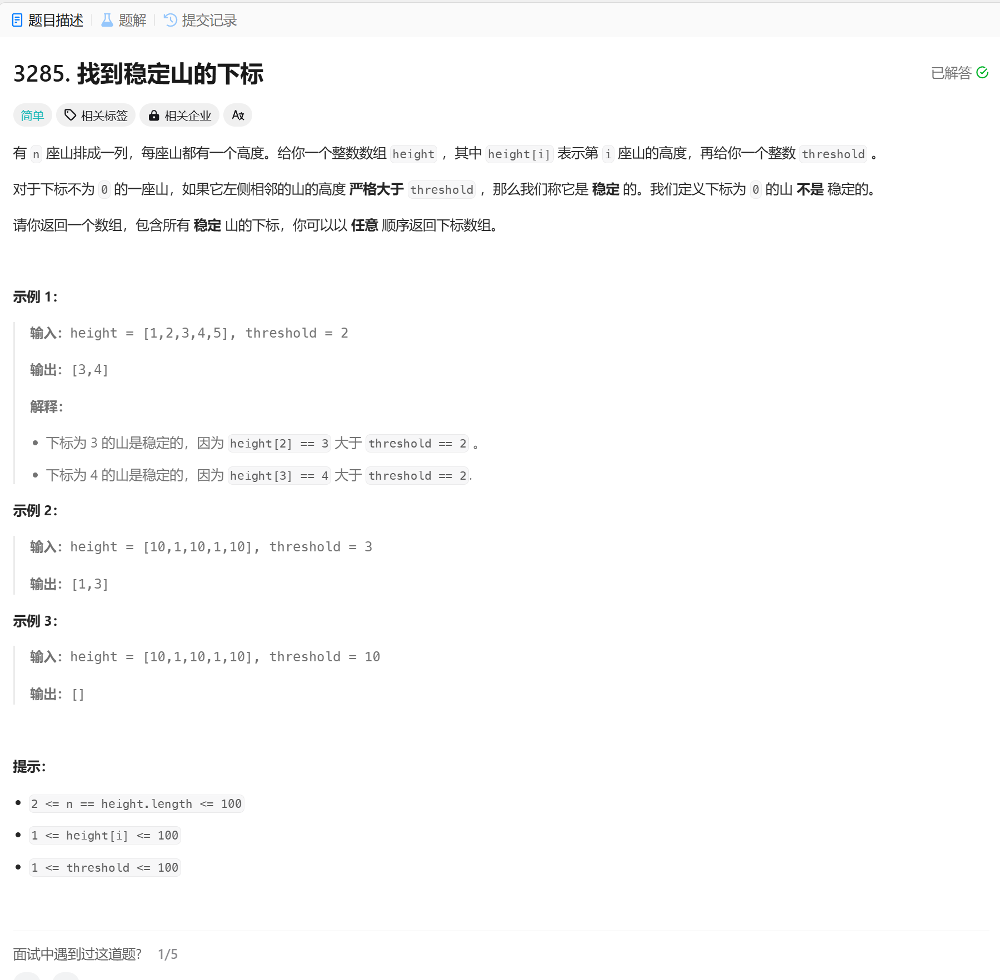

# 3285. 找到稳定山的下标
## 题目链接  
[3285. 找到稳定山的下标](https://leetcode.cn/problems/find-indices-of-stable-mountains/description/?envType=daily-question&envId=2024-12-19)
## 题目详情


***
## 解答一
答题者：EchoBai

### 题解
模拟即可。

### 代码
``` cpp
class Solution {
public:
    vector<int> stableMountains(vector<int>& height, int threshold) {
        int size = height.size();
        vector<int> res;
        for(int i = 1; i < size; ++i){
            if(height[i-1] > threshold){
                res.emplace_back(i);
            }
        }
        return res;
    }
};
```
